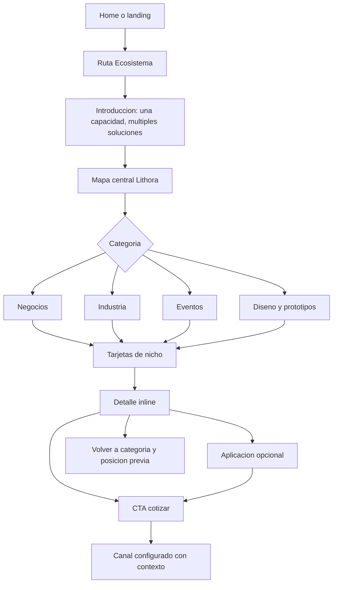

# Diseno: Ecosistema de soluciones por nicho para Lithora 3D

**Estado:** Propuesta para aprobacion
**Fase:** Diseno
**Fuente de verdad:** [requirements.md](requirements.md)
**Alcance:** Experiencia, jerarquia, estados y reglas visuales del MVP. No define codigo, arquitectura tecnica ni tareas.

## 1. Resumen del diseno

La experiencia convierte capacidades de Lithora en oportunidades reconocibles por actividad. Su principio es **Una capacidad. Multiples soluciones.** Lithora es el nucleo que entiende, disena o adapta, valida y fabrica; las cuatro categorias son rutas de exploracion, no lineas de producto.

| Resultado para visitante | Resultado para Lithora |
|---|---|
| Reconoce su actividad, comprende aplicaciones y puede pedir orientacion sin archivo 3D. | Recibe solicitudes con categoria, nicho y aplicacion de origen, y puede crecer por contenido sin cambiar la estructura. |

Este documento toma `requirements.md` como fuente de verdad. Resuelve navegacion, contenido visible, comportamiento y estados sin contradecir sus limites de MVP. La seccion 23 cubre RF, RC, RX, RR, RA, RS, RM, RAD y RN.

## 2. Auditoria del sitio actual

### Hallazgos confirmados

Inspeccion realizada con Chrome DevTools en `https://lithora3d.com/` el 2026-07-17: DOM, estilos computados, scripts, escritorio y telefono emulado.

| Area | Hallazgo |
|---|---|
| Sistema visual | Fondo claro `#F8FAFC`, azul marino `#0F172A`, azul tecnico `#0369A1`, grises azulados y marca geometrica lineal azul. |
| Tipografia | `Inter, system-ui, sans-serif`; titulares pesados, etiquetas en mayusculas y texto de lectura amplio. |
| Espaciado/contenedores | Escala 8/16/24/32/48/80 px; cabecera maximo 1200 px; hero maximo 1280 px. |
| Navegacion | Cabecera fija que cambia de pastilla translucida a barra; menu desplegable y menu movil. |
| CTAs/tarjetas | CTA azul o marino, secundario claro, radio moderado, sombras tenues, foco visible y elevacion solo en escritorio. |
| Imagenes | Hero basado en impresora; los ejemplos actuales son mayormente bloques de contenido, no escenas por nicho. |
| Responsive | La emulacion 390 px no presento desbordamiento horizontal; se muestra menu movil y se oculta navegacion de escritorio. |
| Movimiento | GSAP/ScrollTrigger, revelados por opacidad/transformacion, parallax discreto, cabecera animada y `prefers-reduced-motion`. |
| Reutilizables | Cabecera, color, espaciado, botones, focus, tarjetas, etiquetas y patron de movimiento. |

### Inferencias

- La home comunica maquina y capacidad; esta seccion debe comunicar situacion de uso para complementar, no duplicar, el hero.
- La identidad existente permite una integracion coherente sin añadir otra familia tipografica al MVP.
- El contenido actual confirma que existe un formulario de cotizacion, pero el destino final para este flujo no esta aprobado.

### Recomendaciones

1. Reutilizar roles cromaticos, cabecera, CTA y movimiento existentes, sin repetir la impresora como imagen principal.
2. Publicar una ruta nueva enlazada desde home y landings relacionadas, sin alterar el canal vigente hasta confirmarlo.
3. Dar prioridad editorial a contexto, problema, beneficio y aplicacion, no a una reticula de productos repetidos.

## 3. Principios de diseno

1. **Posibilidad antes que tecnologia:** problema y beneficio preceden CAD, material o impresora.
2. **Orientar antes de pedir:** el CTA aparece tras evidencia y declara que no se necesita archivo 3D.
3. **Contexto antes que objeto:** la imagen muestra uso real; los renders aislados complementan detalle.
4. **Diferenciar con redundancia:** tipo de imagen, categoria y estado usan texto, icono y estructura, no solo color.
5. **Una accion principal por momento:** mapa a categoria, tarjeta a detalle, detalle a cotizacion.
6. **Crecimiento editorial:** cantidades y orden provienen del contenido; no hay dependencia de un numero fijo de tarjetas.
7. **Movimiento con proposito:** solo confirma seleccion, entrada o transicion; nunca retrasa lectura.

## 4. Direccion artistica

| Opcion | Ventajas | Riesgos | Adecuacion |
|---|---|---|---|
| **Taller editorial claro** | Fotografia contextual luminosa, marfil/gris frio, azul tecnico contenido y objetos funcionales. Une las cuatro categorias sin parecer tienda. | Requiere control para no parecer stock. | Alta. Porta QR visible en mesa de restaurante. |
| Atlas modular | Nodos, bloques e ilustracion isometrica escalable. | Puede ser demasiado abstracto para probar utilidad. | Media; adecuado solo para el mapa. |
| Laboratorio monocromo | Renders oscuros y precision tecnica. | Debil para eventos/negocios; se acerca a cyberpunk. | Baja-media; no para el ecosistema. |

### Seleccion: Taller editorial claro

Se selecciona una direccion de fotografia documental de producto: escenas tranquilas, pocos objetos, material imprimible plausible, luz lateral suave, sombras reales y espacio negativo. El minimalismo proviene de composicion y ritmo. Se evitan neones, fondos negros predominantes, glassmorphism repetido, objetos flotantes, gradientes decorativos y stock generico.

## 5. Sistema visual propuesto

| Elemento | Regla |
|---|---|
| Paleta | Reutilizar azul marino para anclaje/CTA de confianza, azul tecnico para seleccion/enlaces, claros para lectura y grises azulados para estructura. Toda combinacion se prueba para RA-005 antes de publicarse. |
| Tipografia | Conservar Inter en MVP. H1 de alto contraste, H2 compacto, H3 de nicho legible, texto de problema/beneficio de ancho limitado y etiquetas solo para metadatos breves. |
| Espaciado | Ritmo amplio entre secciones, medio entre bloques, compacto en controles; problema, beneficio, aplicaciones y CTA permanecen relacionados visualmente. |
| Bordes/sombras | Radio medio consistente; bordes tenues para agrupar; sombras bajas solo en contenido interactivo. |
| Iconos | Lineales, simples y siempre complementados por texto. |
| Imagen | Contextual 4:3 como principal; render 1:1 o 3:4 en detalle. Badge externo, no incrustado en imagen. |
| Contenedor | Contenedor editorial comun; mapa se extiende dentro de limites seguros sin overflow horizontal. |

## 6. Arquitectura de la experiencia

La nueva ruta se enlaza desde home y landings relevantes. Introduccion, mapa central, categoria, nichos, detalle inline y cotizacion forman una narrativa de lo general a lo concreto.

## 7. Estructura de la pagina

| Seccion | Objetivo/contenido | Accion y comportamiento | Requerimientos | Responsive/accesibilidad |
|---|---|---|---|---|
| Hero editorial | H1, capacidades, promesa y ancla al mapa. | "Explorar soluciones"; no parece catalogo. | RF-001, RX-001, RS-001 a RS-005 | Imagen decorativa omitida del lector; CTA con teclado. |
| Mapa central | Nucleo Lithora y cuatro areas. | Rama activa desplaza a categoria y actualiza estado. | RF-002, RX-002, RX-007 | Version apilada movil; teclado sin hover. |
| Navegacion | Categoria, descripcion y conteo cuando exista. | Ancla/boton; anuncia cambio. | RF-002, RF-003, RX-006 | Sin fila horizontal obligatoria. |
| Galeria | Tarjetas ordenadas de nichos publicados. | Default, vacio, carga y error. | RF-003 a RF-005, RF-013 a RF-016 | Tactil; nada esencial solo en hover. |
| Detalle inline | Problema, beneficio, 4-7 aplicaciones, servicios, personalizacion y CTA. | Abre bajo la tarjeta; volver repliega y restaura foco. | RF-004, RF-007, RF-009 a RF-012 | Bloque de lectura en movil. |
| Proceso breve | Necesidad, diseno/adaptacion, validacion y fabricacion en lenguaje simple. | Informativo. | RC-019 | Lista semantica. |
| Sin archivo | "No necesitas un archivo 3D para empezar" y puntos de partida. | CTA secundario opcional. | RF-006, RN-006 | Visible, no oculto en acordeon. |
| Cierre | Personalizacion, nota de evaluacion y CTA final. | Conserva ultimo contexto o inicia solicitud general. | RF-010, RF-011, RN-005, RN-008 | Alto contraste y area tactil amplia. |

## 8. Visualizacion del ecosistema

| Alternativa | Evaluacion |
|---|---|
| Hub radial | Explica nucleo y cuatro areas; necesita adaptacion movil. |
| Nodos libres | Expresivo, pero peor para foco, escala y comprension. |
| Editorial lineal | Muy accesible, pero menos memorable como ecosistema. |
| Composicion 3D | Agrega peso y puede confundir decoracion con navegacion. |

### Opcion seleccionada: hub editorial de cuatro ramas

El nucleo dice: **Lithora 3D: entender, disenar, validar y fabricar**. Cuatro ramas equivalentes son botones con frase de beneficio: Negocios, Industria, Eventos y Diseno y prototipos.

- Inicial: nucleo, ramas e instruccion para elegir contexto.
- Interaccion: activa categoria, resalta conexion, actualiza resumen y lleva a tarjetas.
- Teclado: orden de tabulacion normal; Enter/Espacio activa. No exige flechas.
- Movil: espina editorial vertical, nucleo arriba y cuatro botones grandes; no encoge el mapa radial.
- Movimiento reducido: conectores estaticos y estado inmediato con texto, borde e icono.

## 9. Navegacion por categorias

- Las categorias son controles visibles y enlaces de ancla compartibles, por ejemplo `#negocios`.
- El estado activo usa texto "Categoria activa", icono, borde/superficie y titulo de galeria, no solo color.
- Un cambio real actualiza tarjetas en el orden configurado, anuncia resultado y conserva posicion de lectura.
- En telefono se usan lista de botones grandes o selector expandible legible, nunca pestanas con scroll horizontal obligatorio.
- Sin JavaScript, las anclas muestran categorias agrupadas y contenido publicado en el documento. El filtro no es requisito para acceder al contenido.
- Las URLs individuales de nicho quedan como metadato futuro; no se publican sin RS-011.

## 10. Tarjeta de nicho

### Anatomia

1. Imagen contextual o estado alternativo.
2. Badge: "Proyecto real" o "Ejemplo conceptual"; descriptor opcional "Aplicacion posible" o "Prototipo".
3. Categoria, nombre, problema u oportunidad y beneficio principal.
4. Dos o tres aplicaciones destacadas; detalle con cuatro a siete.
5. Nota: "Se adapta a tu necesidad, contexto o marca".
6. CTA "Ver posibilidades para [nicho]". La cotizacion siempre aparece en el detalle.

| Estado | Respuesta |
|---|---|
| Default | Contenido prioritario y CTA legibles. |
| Hover/focus/active | Elevacion maxima 2 px solo donde exista hover; focus visible equivalente; press breve sin layout shift. |
| Loading | Esqueleto con proporciones finales, sin datos ficticios. |
| Sin imagen/error | Ilustracion estructural no informativa, icono de categoria y todo el contenido/CTA. |
| Contenido incompleto | Solo vista administrativa; nunca publicado. |
| Oculto | Excluido de pagina, navegacion y conteos publicos. |
| Movimiento reducido | Sin elevacion ni transicion de imagen; estados inmediatos. |

## 11. Informacion ampliada del nicho

| Patron | Ventaja | Limite MVP |
|---|---|---|
| Modal | Cierre claro. | Lectura larga movil y foco atrapado. |
| Drawer | Familiar en telefono. | Poco espacio y duplica patron por viewport. |
| Expansion inline | Mantiene contexto, lectura larga, SEO visible y retorno natural. | Requiere uno abierto por categoria. |
| Panel lateral | Mantiene grid en escritorio. | Se convierte en drawer movil. |
| Pagina individual | SEO futuro. | Fuera de alcance inicial. |

### Decision: expansion inline anclada

El MVP abre un detalle bajo la tarjeta activada, con uno abierto por categoria. Es favorable para conversion porque conserva tarjeta y contexto; para SEO porque el contenido sigue en documento; para accesibilidad porque no atrapa foco; para movil porque refluye en lectura continua; y para rendimiento porque no cambia de ruta. Al cerrar, vuelve al control de origen y conserva filtro/fragmento y posicion. Una pagina individual futura reutilizara este contenido solo al cumplir RS-011.

## 12. Flujo hacia la cotizacion

1. CTA de detalle: "Explorar una solucion parecida".
2. Se muestra resumen de categoria, nicho y aplicacion elegida si existe.
3. Mensaje sugerido editable: "Quiero explorar una solucion para [nicho] dentro de [categoria], parecida a [aplicacion]. No tengo/si tengo una referencia o archivo.".
4. Se transfieren categoria, id/nombre de nicho, aplicacion, ruta de origen y referencia/tipo de imagen.
5. El canal sin configurar se deshabilita con causa textual y alternativa solo si esta validada; nunca se finge envio.
6. Confirmacion repite nicho de origen, permite volver y dispara RM-005 a RM-009 aplicables.

La interfaz es desacoplada de formulario, WhatsApp u otro canal: recibe etiqueta, destino, disponibilidad y campos aceptados. La eleccion del canal queda pendiente.

## 13. Sistema de movimiento y animacion

| Animacion | Disparador / propiedades | Duracion | Reducido / riesgo | Objetivo |
|---|---|---|---|---|
| Hero | Primera vista; `opacity`, `translateY`. | 360-520 ms | Estado final inmediato; no bloquear LCP. | Jerarquia. |
| Mapa | Carga y categoria activa; opacidad/transform de conexiones. | 180-300 ms | Conectores estaticos. | Relacion nucleo-area. |
| Categoria | Cambio real; fundido y 8-12 px. | 180-240 ms | Reemplazo inmediato; no animar altura. | Confirmacion. |
| Tarjeta | Hover/focus/press; transform, borde, sombra. | 120-180 ms | Sin elevacion. | Descubribilidad. |
| Detalle | Abrir/cerrar; opacidad y 12 px. | 240-320 ms | Mostrar/ocultar inmediato. | Continuidad. |
| Imagen | Al cargar; opacidad y escala 1.02 a 1. | 180-280 ms | Cambio inmediato; ratio reservado. | Evitar destello/CLS. |
| CTA/ancla | Activar; color/transform max 2 px y scroll nativo. | 100-300 ms | Sin movimiento. | Feedback sin secuestrar scroll. |

No hay carruseles automaticos, movimiento constante, cursor tracking, scroll hijacking, parallax movil ni transiciones que cambien dimensiones. Se prefiere `transform` y `opacity`.

## 14. Diseno responsive

| Rango | Prioridad | Comportamiento |
|---|---|---|
| Escritorio amplio | Mapa y narrativa legibles en una secuencia. | Hub radial editorial, navegacion visible, detalle inline de ancho editorial. |
| Laptop | Conservar estructura antes de reducir tipografia. | Mapa se compacta sin eliminar etiquetas; tarjetas conservan problema, beneficio y CTA. |
| Tableta | Orden lineal claro. | Categorias se envuelven o usan selector; detalle toma region completa. |
| Telefono | Problema, beneficio y accion primero. | Mapa apilado, una categoria visible, tarjetas secuenciales, detalle en flujo y CTA al final. Sin parallax. |
| Pantalla pequena | Eliminar decoracion antes que contenido. | Lista vertical, sin truncar nombre/aplicaciones/beneficio/CTA; imagen conserva alt y badge. |

En todos los rangos no hay desplazamiento horizontal obligatorio; texto e imagen se adaptan y los controles son tactiles. No se fija una cantidad de columnas: se valida por legibilidad y contenido.

## 15. Accesibilidad

| Tema | Decision | Requerimientos |
|---|---|---|
| Teclado/foco | Orden: skip link, hero, mapa, categorias, tarjetas, detalle, proceso, orientacion, CTA. Foco visible. | RA-001, RA-002 |
| Semantica | H1 unico; H2 secciones/categorias; H3 nichos; listas para aplicaciones. | RA-003, RS-004, RS-005 |
| Imagen | Alt contextual; decorativas omitidas; badge UI no finge proyecto real. | RA-004, RF-008, RC-009, RC-010 |
| Estados | Contraste verificado; texto/icono acompanan color. | RA-005, RA-007 |
| Nombres/areas | CTA especifica destino/contexto; objetivos tactiles amplios. | RA-006, RA-009 |
| Detalle | `aria-expanded`, encabezado identificable y retorno de foco al cerrar. | RA-001 a RA-003 |
| Movimiento/errores | `prefers-reduced-motion`; region discreta anuncia cambio, error o exito. | RA-008, RX-007 |

## 16. Estrategia de contenido visual con OpenArt

### Consistencia

Fotografia documental de producto para un estudio mexicano de fabricacion 3D: marfil/gris frio, luz lateral de ventana, azul tecnico contenido, perspectiva 50 mm, profundidad moderada, objetos con escala/material plausible y espacio negativo a la izquierda. Prohibidos logos, texto, QR funcional, marcas, personas identificables, watermarks, neon, vidrio repetido y objetos flotantes. Toda generacion se etiqueta **Ejemplo conceptual** hasta validacion independiente de proyecto real.

| Categoria | Nicho / aplicacion | Tipo / objetivo | Aspecto / ubicacion | Etiqueta / alt | Estado |
|---|---|---|---|---|---|
| Negocios | Restaurante: porta QR, soporte de menu, organizador. | Contextual: uso en mesa. | 4:3, tarjeta. | Ejemplo conceptual. "Porta QR impreso en 3D sobre una mesa de restaurante." | Generado `tTEG6MIoL7G165hMot6f` |
| Negocios | Punto de venta: display. | Contextual, siguiente tanda. | 4:3, tarjeta secundaria. | Ejemplo conceptual. "Soporte personalizado para producto en punto de venta." | Pendiente |
| Industria | Taller: soporte funcional y bandeja. | Contextual: banco de trabajo. | 4:3, tarjeta. | Ejemplo conceptual. "Soporte funcional impreso en 3D junto a herramientas de taller." | Generado `jlo0Y6JQ27x4BjMmmNwY` |
| Industria | Manufactura: plantilla/contenedor. | Render complementario. | 1:1, detalle. | Aplicacion posible. "Plantilla funcional impresa en 3D." | Pendiente |
| Eventos | Recepcion: marcador y decoracion. | Contextual: mesa sobria. | 4:3, tarjeta. | Ejemplo conceptual. "Marcador de mesa impreso en 3D para un evento." | Generado `J0LODuUCWrarZY57AsUn` (`LQU9SCgoJMuPjMwRbgsA`) |
| Diseno y prototipos | Arquitectura: maqueta y mobiliario. | Contextual: mesa de estudio. | 4:3, tarjeta. | Ejemplo conceptual. "Maqueta arquitectonica impresa en 3D sobre una mesa de trabajo." | Generado `zSMRPYuYVIv7COn64l3X` (`bWmjemShilKIvHtNUsMg`) |
| Diseno y prototipos | Producto/educacion: iteracion. | Render complementario. | 1:1, detalle. | Prototipo conceptual. "Piezas para validar un diseno de producto." | Pendiente |

### Prompt maestro OpenArt

> Campaign style: premium documentary product photography for a contemporary Mexican 3D fabrication studio. Bright ivory and cool pale-gray environment, restrained slate navy and technical blue accents only, soft north-window key light, subtle practical shadows, moderate depth of field, 50mm camera perspective, clean composition with generous negative space on the left, physically plausible matte FDM printed polymer with visible but refined layer texture, real scale, calm and useful rather than futuristic. No logos, no brand names, no readable text, no watermarks, no neon, no glassmorphism, no floating objects, no impossible geometry, no human faces.

| Escena | Prompt especifico | Negative prompt |
|---|---|---|
| Restaurante/cafeteria | Premium restaurant table with a custom printed tabletop QR holder, understated menu stand and compact organizer; unbranded, functional, no text; seated guest perspective, object right third. | stock photo, people, words, QR codes, branded packaging, retail grid |
| Punto de venta | Clean independent retail counter with modular printed product display and organizer, generic unbranded product, three-quarter view, display right third. | logos, readable labels, supermarket aisle, people, watermarks, neon |
| Taller/refacciones | Organized automotive workbench with sturdy printed mounting bracket and fastener tray beside unbranded tools, bracket right third. | car logos, faces, oily clutter, unsafe workshop, text, sci-fi machinery |
| Industria | Compact manufacturing station with printed assembly fixture and stackable container used in workflow, elevated three-quarter angle. | factory logos, worker faces, warning text, robots, neon, watermark |
| Evento | Elegant intimate reception table with unbranded printed marker, decorative component and recognition object, no names/letters, object right third. | wedding couple, names, glitter, text, watermarks, luxury cliches |
| Arquitectura/maqueta | Calm architect studio table with printed massing model, furniture-scale pieces and iterations, three-quarter tabletop angle, model right third. | recognizable building, blueprints with text, people, sci-fi city, watermark |
| Diseno de producto | Material study table with three printed iterations of a functional enclosure, one hero on right, neutral tools. | consumer brands, logos, text, impossible mechanism, people |
| Educacion/prototipado | University-style workshop table with tactile printed learning models and simple prototype, no branding/notes, object right third. | school logos, students faces, notebooks, toy aesthetic, text, neon |

Prueba: GPT Image 2, `text2image`, 2k, 4:3, calidad alta, 150 creditos por imagen. Se completaron cuatro recursos, uno por categoria principal: restaurante (`j8TjR80RCWAJKSXAr3rD`), taller (`XvmN45WzFzw5J6NPKIZI`), evento (`LQU9SCgoJMuPjMwRbgsA`) y maqueta (`bWmjemShilKIvHtNUsMg`). Los recursos son conceptos y requieren seleccion visual humana antes de usarse. Chrome DevTools no pudo abrir la URL directa de imagen para inspeccion visual porque devolvio `net::ERR_ABORTED`; no se afirma calidad visual no verificada.

## 17. Componentes conceptuales

Los nombres son conceptuales. Cada componente recibe contenido validado y no decide por si mismo la capacidad, la procedencia de una imagen ni la disponibilidad de cotizacion.

| Componente | Responsabilidad y contenido recibido | Estados e interacciones | Responsive y accesibilidad | Requerimientos |
|---|---|---|---|---|
| `EcosystemHero` | Presenta H1, etiqueta, promesa, resumen de capacidades y destino de ancla. | Carga, normal, movimiento reducido; CTA lleva al mapa. | En movil prioriza H1, resumen y CTA; imagen no esencial se vuelve decorativa. Un H1 y CTA con nombre descriptivo. | RF-001, RX-001, RS-004, RA-001, RA-003, RA-006 |
| `EcosystemMap` | Recibe texto del nucleo, cuatro categorias, descripcion breve, categoria activa y anclas. | Default, categoria activa, focus, reducido; activa rama por click, toque, Enter o Espacio. | Radial en ancho amplio, espina vertical en movil. Cada rama es boton/enlace con estado textual e icono. | RF-002, RX-002, RX-006, RA-001, RA-002, RA-007, RR-001 a RR-004 |
| `CategoryNavigation` | Recibe categorias publicadas, estado activo, conteo opcional y destinos de ancla. | Default, activa, categoria sin nichos, sin JavaScript; cambia de categoria y anuncia resultado. | Filas ajustables o selector expandible, nunca scroll horizontal obligatorio. Nombre activo y foco visible. | RF-002, RF-003, RX-002, RX-007, RR-001 a RR-003, RA-001 a RA-007 |
| `NicheGrid` | Recibe categoria activa y solo nichos publicados en orden configurado. | Cargando, poblado, vacio, error de datos; no renderiza ocultos. | Refluye segun ancho sin perder contenido. La region tiene encabezado y estado anunciado. | RF-003, RF-013 a RF-016, RC-012, RC-013, RAD-003 a RAD-006 |
| `NicheCard` | Recibe categoria, nombre, descripcion, problema, beneficio, aplicaciones destacadas, personalizacion, imagen y CTA de ampliar. | Default, hover, focus, active, loading, sin imagen, error de recurso, reducido. Activa detalle sin depender de hover. | Informacion esencial siempre visible; objetivo tactil util; encabezado de nicho identificable. | RC-001 a RC-013, RX-003 a RX-006, RR-004 a RR-006, RA-002, RA-006, RA-009 |
| `NicheImage` | Recibe recurso, ratio, alt, tipo de imagen y estado de carga. | Cargando, proyecto real, concepto, sin imagen, error. | Mantiene ratio para evitar CLS; alt informativo o vacio si decorativo. | RF-008, RF-016, RC-008 a RC-010, RA-004, RN-002, RN-003 |
| `ImageTypeBadge` | Recibe tipo `proyecto_real` o `ejemplo_conceptual` y descriptor opcional. | Real, conceptual, aplicacion posible, prototipo; no se oculta por hover. | Permanece fuera de la imagen y se ajusta al ancho disponible. Combina texto, icono y color. | RF-008, RC-009, RA-007, RN-002, RN-003 |
| `ApplicationList` | Recibe cuatro a siete aplicaciones ordenadas y el indicador de interactividad. | Default, seleccionada, no interactiva; seleccion opcional conserva contexto para cotizacion. | Lista vertical de lectura en movil; nombres completos y objetivos tactiles cuando sean accionables. | RF-004, RC-005, RM-004, RA-003, RA-006 |
| `NicheDetail` | Recibe el nicho completo, servicios relacionados validados, aplicaciones, aviso de personalizacion, imagenes secundarias y CTA. | Cerrado, abierto, cargando, error; abre debajo de la tarjeta y vuelve a categoria. | En movil ocupa flujo completo. Boton expone expansion, el encabezado recibe foco cuando procede y el cierre lo devuelve al origen. | RF-009, RF-012, RX-005, RX-008, RA-001 a RA-003, RA-006 |
| `PersonalizationNotice` | Recibe copy aprobado sobre adaptacion a necesidad, marca o contexto. | Estatico; puede repetir una variante corta en tarjeta y larga en detalle. | No se colapsa en movil; lenguaje claro y no tecnico. | RF-007, RC-014, RC-016, RX-009, RN-008 |
| `NoFileRequiredCallout` | Recibe mensaje aprobado, ejemplos de puntos de partida y CTA opcional. | Estatico, CTA disponible/no configurado. | Se mantiene visible en todos los rangos; se anuncia como informacion importante, no como requisito. | RF-006, RN-006, RR-005, RA-003 |
| `QuoteCTA` | Recibe etiqueta, disponibilidad, destino configurado, categoria, nicho, aplicacion opcional y mensaje sugerido. | Disponible, no configurado, iniciando, error, exito; dispara inicio y transferencia de contexto. | CTA visible al final de detalle y cierre, con area tactil util. El estado usa texto y no solo color. | RF-010, RF-011, RX-005, RX-008, RM-005 a RM-009, RN-004, RN-005 |
| `ConceptDisclaimer` | Recibe copy aprobado de limites: ejemplos, disponibilidad, precios y evaluacion previa. | Estatico; variante corta junto a imagen y completa antes del cierre. | Legible sin interferir con CTA; semantica de nota informativa. | RC-015 a RC-017, RN-007, RN-008, RA-007 |
| `EmptyImageState` | Recibe categoria, nombre de nicho y accion de ampliar; no recibe afirmaciones visuales no validadas. | Sin imagen, recurso fallido; conserva dimensiones y CTA. | Ilustracion decorativa omitida por lector; texto de estado visible. | RF-016, RC-008, RA-004 |
| `Breadcrumb` | Recibe ruta actual y, solo si existe, futura ruta individual aprobada. | Estatico. | Puede envolver en varias lineas sin truncar; usa enlaces con destino claro. | RS-007, RS-010, RA-001, RA-006 |
| `AnalyticsBoundary` | Recibe identificadores de ruta, categoria, nicho, aplicacion, CTA y canal. | Registra eventos unicos tras confirmacion de accion, sin UI propia. | No altera foco ni lectura; no requiere interaccion adicional. | RF-017, RM-001 a RM-009 |

## 18. Modelo de contenido

| Entidad | Campos |
|---|---|
| Categoria | id, nombre, descripcion, orden, estado, ancla/ruta. |
| Nicho | id, categoriaId, nombre, descripcion, problemaOportunidad, beneficioPrincipal, aplicaciones, CTA, orden, estadoPublicacion, fechaActualizacion; servicios y SEO individual solo validados. |
| Aplicacion | id, nombre, descripcion opcional, orden, interactiva, referencia visual opcional. |
| Imagen | id, fuente, alt, tipoImagen, ratio, estado; permiso/credito si aplica. |
| Tipo | `proyecto_real` o `ejemplo_conceptual`; descriptor `aplicacion_posible` o `prototipo` opcional. |
| CTA | etiqueta, destino/configuracion, disponibilidad, mensaje sugerido. |
| SEO | ruta, titulo, descripcion, social, indicador de suficiencia de contenido. |

**Demostracion no publicable:** Negocios > Restaurantes y cafeterias; problema: organizar mesa sin piezas genericas; beneficio: elementos adaptables al espacio y operacion; aplicaciones: porta QR, portamenu, numero de mesa, organizador; imagen: ejemplo conceptual; CTA: "Explorar una solucion para mi mesa".

## 19. Estados y manejo de errores

| Situacion | Respuesta / accion |
|---|---|
| Categoria sin nichos | Mensaje claro y otras categorias disponibles; orientacion general solo con canal validado. |
| Sin imagen / error de imagen | Fallback de dimensiones estables; contenido y CTA permanecen. |
| Detalle falla | Mensaje en espacio reservado, reintento y regreso disponible. |
| CTA/canal no disponible | Deshabilitado con causa en texto; no simula envio ni exito. |
| Carga / datos incompletos | Esqueleto con `aria-busy`; nicho incompleto solo en administracion, nunca publicado. |
| Sin conexion / error envio | Conserva contexto/texto, explica causa y permite reintento. |
| Envio correcto | Confirmacion textual con categoria/nicho y retorno a la seccion. |

## 20. Rendimiento

- Primera vista: H1, texto, CTA y mapa; no video ni 3D interactivo bloqueante.
- Imagen visible inicial: variantes responsive, ratio declarado y objetivo menor a 250 KB comprimidos. Secundarias: carga diferida y objetivo menor a 180 KB por variante.
- Originales OpenArt 2k son fuente de trabajo, no peso de entrega. Deben optimizarse y revisarse antes de publicar.
- Render 3D interactivo, video autoplay y nueva familia tipografica quedan fuera del MVP.
- Reservar alturas de imagen/detalle para evitar CLS; reutilizar fuentes existentes; liberar optimizaciones temporales al terminar animacion.

## 21. SEO aplicado al diseno

- Ruta indexable, H1 unico y encabezados H2/H3 jerarquicos.
- Aplicaciones en texto/listas indexables; tarjetas y detalles publicados accesibles sin JavaScript.
- Breadcrumb y enlaces hacia servicio, prototipado, materiales o precios solo cuando la relacion sea real; enlaces inversos al publicar.
- Alt contextual y badge externo; el texto no depende de imagen.
- Sitemap, title, description y metadatos sociales se resuelven al publicar. Una URL individual necesita contenido unico suficiente, aplicaciones y CTA antes de indexarse.

Esto implementa RS-001 a RS-011 sin forzar rutas individuales prematuras.

## 22. Analitica aplicada al diseno

| Evento | Componente/momento | Datos | Antiduplicado |
|---|---|---|---|
| `ecosystem_section_view` | `AnalyticsBoundary`, primera visibilidad. | fechaHora, ruta, referrer, dispositivo. | Una vez por carga. |
| `ecosystem_category_select` | Mapa/navegacion, cambio real. | categoriaId/nombre, ruta, dispositivo. | No al re-render. |
| `ecosystem_niche_open` | Detalle abierto. | nichoId/nombre, categoria, ruta, dispositivo. | Una vez por apertura. |
| `ecosystem_application_click` | Aplicacion seleccionada. | nichoId, categoria, aplicacion, ruta. | No si ya era activa. |
| `ecosystem_quote_click` | CTA activado. | nichoId/nombre, categoria, CTA, ruta, dispositivo. | Bloquea doble click. |
| `ecosystem_quote_start` | Canal confirma inicio. | nichoId, categoria, canal, rutaOrigen. | Una vez por intento. |
| `ecosystem_quote_complete` | Canal confirma envio. | nichoId, categoria, canal, estadoEnvio. | Solo respuesta positiva. |
| `ecosystem_origin_context` | Antes de cambiar de canal. | nichoId/nombre, categoria, rutaOrigen. | Una vez por transferencia. |
| `ecosystem_attachment_use` | Adjuntar/intentarlo si existe. | nichoId, categoria, tipoAccion, resultado. | Una vez por resultado. |

## 23. Trazabilidad

| IDs | Decision | Seccion/componente | Validacion |
|---|---|---|---|
| RF-001 | Hero de capacidades como soluciones. | 7, `EcosystemHero` | H1 y copy mencionan capacidad/personalizacion. |
| RF-002, RF-003 | Mapa, anclas y grid por categoria. | 8, 9, `CategoryNavigation` | Cuatro categorias y solo nichos publicados asignados. |
| RF-004, RF-005 | Beneficio visible y lista de 4-7 aplicaciones. | 10, `NicheCard`, `ApplicationList` | Conteo y contenido antes de cotizar. |
| RF-006, RF-007 | Callout sin archivo y aviso de personalizacion. | 7, 12, 17 | Ambos textos visibles antes de CTA. |
| RF-008, RF-016 | Badge y fallback de imagen. | 10, 16, 19 | Tipo/fallback visible sin color exclusivo. |
| RF-009 a RF-012 | Detalle inline, CTA contextual y retorno. | 11, 12 | Abrir, cotizar y volver conservan contexto/foco. |
| RF-013, RF-014, RF-015 | Modelo por contenido, estado y orden. | 17, 18 | Nuevo nicho no altera estructura. |
| RF-017, RM-001, RM-002, RM-003, RM-004, RM-005, RM-006, RM-007, RM-008, RM-009 | Limites analiticos por accion. | 22 | Payload minimo sin duplicado. |
| RC-001, RC-002, RC-003, RC-004, RC-005, RC-006, RC-007, RC-008, RC-009, RC-010, RC-011, RC-012, RC-013, RN-001 | Campos obligatorios de categoria/nicho/imagen/CTA. | 10, 18, 19 | Publicacion impide campos faltantes. |
| RC-014, RC-015, RC-016, RC-017, RC-018, RC-019 | Lenguaje no tecnico, veraz y especifico; problema antes de proceso. | 3, 7, 16 | Revision editorial. |
| RX-001, RX-002, RX-003, RX-004, RX-005, RX-006, RX-007, RX-008, RX-009 | Narrativa, navegacion, contenido visible, feedback, tactil y personalizacion. | 7 a 13 | Pruebas de tarea en mouse, tactil y teclado. |
| RR-001, RR-002, RR-003, RR-004, RR-005, RR-006 | Prioridad por viewport y CTA alcanzable. | 14 | Sin overflow ni ocultar datos esenciales. |
| RA-001, RA-002, RA-003, RA-004, RA-005, RA-006, RA-007, RA-008, RA-009 | Foco, semantica, alt, contraste, estados y movimiento reducido. | 15 | Auditoria manual/automatizada. |
| RS-001, RS-002, RS-003, RS-004, RS-005, RS-006, RS-007, RS-008, RS-009, RS-010, RS-011 | Ruta, headings, contenido visible, enlaces, sitemap y futuras rutas. | 21 | Revision de DOM/metadata/contenido minimo. |
| RAD-001, RAD-002, RAD-003, RAD-004, RAD-005, RAD-006, RAD-007, RAD-008, RAD-009, RAD-010 | Datos editables, estado, orden, tipo, CTA y fecha. | 18 | Responsable puede gestionar cada campo. |
| RN-002, RN-003, RN-004, RN-005, RN-006, RN-007, RN-008 | Procedencia, contexto, sin precio/archivo como bloqueo y limites de ejemplo. | 10, 12, 16, 19 | Validacion de publicacion/cotizacion. |

## 24. Decisiones y supuestos

### Confirmadas

- Categorias: Negocios, Industria, Eventos y Diseno y prototipos.
- Ruta publica e indexable, no catalogo cerrado.
- Archivo 3D no obligatorio.
- Conceptos identificados; no se presentan como proyectos reales.
- Sin ecommerce, pago, precio automatico, configurador, IA, cuentas ni rutas individuales para todos los nichos.

### Propuestas reversibles

- Taller editorial claro, hub de cuatro ramas, expansion inline, fragmentos compartibles y contextual 4:3 como recurso principal.

### Supuestos temporales

- El canal podra transportar categoria/nicho/aplicacion.
- Los nichos de demostracion no se publican hasta validar capacidad, copy e imagen.
- OpenArt sirve para conceptos, no evidencia de trabajos de Lithora.

### Pendientes y bloqueadores de publicacion

1. Canal final y datos obligatorios de cotizacion.
2. Nichos iniciales, cantidad y capacidad vigente validada.
3. Proyectos reales, permisos y fotografia disponible.
4. Administracion de contenido y analitica existente.
5. Ruta final, title, description y copy aprobados.

No bloquean la arquitectura, pero si la publicacion y la validacion de conversion end-to-end.

## 25. Criterios de aprobacion del diseno

1. La trazabilidad cubre todas las familias de requerimientos aplicables.
2. El visitante descubre categorias, nichos y aplicaciones sin conocimiento tecnico.
3. La experiencia se entiende como ecosistema personalizable, no tienda o marketplace.
4. Archivo no obligatorio y personalizacion son claros antes de cotizar.
5. Categoria, nicho y aplicacion se conservan en la solicitud.
6. La estrategia visual es consistente y los conceptos se identifican fuera de la imagen.
7. Cada animacion tiene proposito, limite de rendimiento y alternativa reducida.
8. Movil no requiere scroll horizontal y mantiene CTA/navegacion accesibles.
9. Teclado, foco, headings, alt, contraste y estados redundantes estan definidos.
10. Nuevos nichos pueden agregarse, ocultarse u ordenarse sin redisenar.
11. Estados vacios, fallos y resultados de cotizacion estan resueltos.
12. Se puede derivar `tasks.md` sin reabrir decisiones estructurales, salvo los bloqueadores enumerados.
