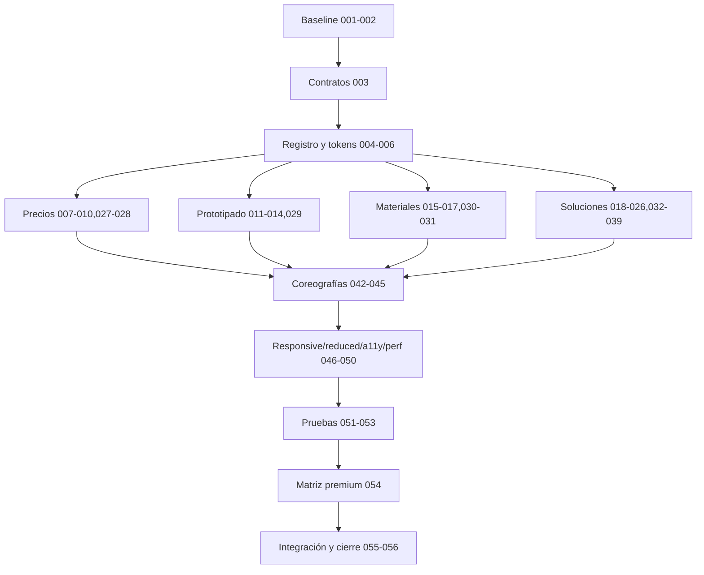

# Tareas — Premium Widget Motion

## 1. Resumen de implementación

- **Iniciativa:** Premium Widget Motion — segunda iteración.
- **Objetivo técnico:** migrar 44 widgets desde presets posicionales a contratos explícitos bajo “Ensamble de precisión”.
- **Resultado:** cuatro firmas propias con estados completos, mejora progresiva y evidencia individual.
- **Fuentes:** `requirements.md` (68 requisitos) y `design.md` (44 widgets, 28 secciones más §27.1 de referencias aprobadas).
- **Rutas:** Precios, Prototipado, Materiales y Soluciones.
- **Inventario:** A 19, B 13, C 10, D 2.
- **Presupuesto:** CSS+JS motion ≤35 KB; 1 observer; ≤10 listeners; 2A/8 nodos desktop; 1A/5 móvil; timeline ≤8 nodos; CLS 0; sin long tasks >50 ms atribuibles.
- **Restricción:** no agregar ni modificar contenido comercial, rutas, imágenes o dependencias.
- **Preservar:** WAAPI, no-JS, reduced, touch, foco, hash/history, analítica, etiquetas y WhatsApp.
- **DoD:** 44 widgets y 68 requisitos aprobados, suite/evidencia/matriz completas, cero regresiones o tareas locales pendientes.

## 2. Hallazgos técnicos comprobados

### Confirmado

- `assets/motion-pages.js` usa WAAPI, un IntersectionObserver, diez listeners, inicialización idempotente, debug, bfcache y cleanup.
- `motion-pages.css` contiene tokens y scope `data-motion-page`; CSS+JS finales suman 33,116 bytes (32.34 KB).
- Reduced motion, touch, no-JS y eventos de Soluciones existen; suite disponible mediante `npm run validate` y navegador mediante `npm run test:browser`.
- Soluciones conserva hash, history, detalle, foco, contexto, analítica y WhatsApp.

### Inferido

- El registro puede permanecer en los dos assets actuales sin módulo ni dependencia nueva.
- Un listener delegado puede sustituir listeners repetidos sin superar diez.

### Validado durante implementación

- Baseline, soporte bfcache, métricas de las cuatro firmas y calidad premium quedaron comprobados en `audits/2026-07-20/premium-widget-motion/report.md`.

## 3. Estrategia general de implementación

Se congela baseline; se añaden contratos compatibles; se crea registro/scheduler; se migran widgets sin doble motor; se valida cada página antes de integración. Precios, Prototipado y Materiales pueden avanzar en paralelo después de TASK-PWM-006; Soluciones sigue ruta secuencial por sus dependencias. Cada grupo debe pasar pruebas y evidencia antes del siguiente gate.

## 4. Inventario de tareas por widget

| Widget | Página | Nivel | Tareas | Estado | Dependencias | Prueba principal | Evidencia |
|---|---|:---:|---|---|---|---|---|
| PRI-W01 | Precios | C | TASK-PWM-040 | Completado | TASK-PWM-003,006 | focus/aislamiento | captura |
| PRI-W02 | Precios | C | TASK-PWM-040 | Completado | TASK-PWM-003,006 | reveal once | captura |
| PRI-W03 | Precios | A | TASK-PWM-007 | Completado | TASK-PWM-003–006 | LCP/filmstrip | video |
| PRI-W04 | Precios | A | TASK-PWM-008 | Completado | TASK-PWM-007 | conteo | video |
| PRI-W05 | Precios | A | TASK-PWM-009 | Completado | TASK-PWM-008 | comparación | video |
| PRI-W06 | Precios | A | TASK-PWM-010 | Completado | TASK-PWM-009 | firma distinta | video |
| PRI-W07 | Precios | B | TASK-PWM-027 | Completado | TASK-PWM-010 | calma | captura |
| PRI-W08 | Precios | B | TASK-PWM-028 | Completado | TASK-PWM-010 | focus/touch | video |
| PRO-W01 | Prototipado | C | TASK-PWM-040 | Completado | TASK-PWM-003,006 | focus | captura |
| PRO-W02 | Prototipado | C | TASK-PWM-040 | Completado | TASK-PWM-003,006 | once | captura |
| PRO-W03 | Prototipado | A | TASK-PWM-011 | Completado | TASK-PWM-003–006 | LCP | video |
| PRO-W04 | Prototipado | A | TASK-PWM-012 | Completado | TASK-PWM-011 | semántica | video |
| PRO-W05 | Prototipado | A | TASK-PWM-013 | Completado | TASK-PWM-012 | responsive | video |
| PRO-W06 | Prototipado | A | TASK-PWM-014 | Completado | TASK-PWM-013 | sin progreso | video |
| PRO-W07 | Prototipado | B | TASK-PWM-029 | Completado | TASK-PWM-014 | CTA | video |
| MAT-W01 | Materiales | C | TASK-PWM-040 | Completado | TASK-PWM-003,006 | focus | captura |
| MAT-W02 | Materiales | C | TASK-PWM-040 | Completado | TASK-PWM-003,006 | once | captura |
| MAT-W03 | Materiales | A | TASK-PWM-015 | Completado | TASK-PWM-003–006 | LCP | video |
| MAT-W04 | Materiales | A | TASK-PWM-016 | Completado | TASK-PWM-015 | no acción falsa | video |
| MAT-W05 | Materiales | A | TASK-PWM-017 | Completado | TASK-PWM-016 | CLS/states | video+trace |
| MAT-W06 | Materiales | B | TASK-PWM-030 | Completado | TASK-PWM-017 | diferenciación | video |
| MAT-W07 | Materiales | B | TASK-PWM-031 | Completado | TASK-PWM-030 | touch/focus | video |
| SOL-W01 | Soluciones | B | TASK-PWM-032 | Completado | TASK-PWM-006 | menú/foco | video |
| SOL-W02 | Soluciones | A | TASK-PWM-018 | Completado | TASK-PWM-003–006 | LCP | video |
| SOL-W03 | Soluciones | A | TASK-PWM-019 | Completado | TASK-PWM-018 | cero loop | video+debug |
| SOL-W04 | Soluciones | C | TASK-PWM-040 | Completado | TASK-PWM-020 | calma | captura |
| SOL-W05 | Soluciones | A | TASK-PWM-020 | Completado | TASK-PWM-019 | mapa | video |
| SOL-W06 | Soluciones | B | TASK-PWM-033 | Completado | TASK-PWM-020 | event/hash | video+test |
| SOL-W07 | Soluciones | C | TASK-PWM-040 | Completado | TASK-PWM-020 | puente | captura |
| SOL-W08 | Soluciones | B | TASK-PWM-034 | Completado | TASK-PWM-033 | history | video+test |
| SOL-W09 | Soluciones | A | TASK-PWM-021 | Completado | TASK-PWM-020,034 | CLS/cancel | trace |
| SOL-W10 | Soluciones | B | TASK-PWM-035 | Completado | TASK-PWM-021 | open | video |
| SOL-W11 | Soluciones | C | TASK-PWM-040 | Completado | TASK-PWM-024 | imagen/badge | captura |
| SOL-W12 | Soluciones | B | TASK-PWM-036 | Completado | TASK-PWM-022 | contexto | video+test |
| SOL-W13 | Soluciones | A | TASK-PWM-022,023 | Completado | TASK-PWM-021,036 | origen/foco | video+test |
| SOL-W14 | Soluciones | A | TASK-PWM-024 | Completado | TASK-PWM-022 | lazy/error | video |
| SOL-W15 | Soluciones | B | TASK-PWM-037 | Completado | TASK-PWM-022,023 | Escape/foco | video |
| SOL-W16 | Soluciones | B | TASK-PWM-038 | Completado | TASK-PWM-021 | error/retry | video |
| SOL-W17 | Soluciones | D | TASK-PWM-041 | Completado | TASK-PWM-040 | calma | captura |
| SOL-W18 | Soluciones | A | TASK-PWM-025 | Completado | TASK-PWM-020 | sin progreso | video |
| SOL-W19 | Soluciones | C | TASK-PWM-040 | Completado | TASK-PWM-036 | contexto | captura |
| SOL-W20 | Soluciones | A | TASK-PWM-026 | Completado | TASK-PWM-006,038 | estados reales | video+test |
| SOL-W21 | Soluciones | B | TASK-PWM-039 | Completado | TASK-PWM-026 | handoff | video+test |
| SOL-W22 | Soluciones | D | TASK-PWM-041 | Completado | TASK-PWM-040 | reposo | captura |

## 5. Plan por fases

| Fase | Tareas | Dependencias | Resultado y criterio de salida |
|---|---|---|---|
| Fase 0 — Auditoría | TASK-PWM-001–002 | Ninguna | Baseline técnica y visual aprobada. |
| Fase 1 — Contratos y fundamentos | TASK-PWM-003–005 | Fase 0 | Contratos, registro y scheduler operativos. |
| Fase 2 — Primitivas globales | TASK-PWM-006, 040–041 | Fase 1 | Estados compartidos y reglas C/D sin firma genérica. |
| Fase 3 — Precios | TASK-PWM-007–010, 027–028, 042 | Fase 2 | Precisión y decisión validadas. |
| Fase 4 — Prototipado | TASK-PWM-011–014, 029, 043 | Fase 2 | Evolución e iteración validadas. |
| Fase 5 — Materiales | TASK-PWM-015–017, 030–031, 044 | Fase 2 | Tactilidad honesta validada. |
| Fase 6 — Soluciones | TASK-PWM-018–026, 032–039, 045 | Fase 2 | Cadena contextual completa. |
| Fase 7 — Responsive, touch y reduced motion | TASK-PWM-046–048 | Fases 3–6 | Matriz adaptativa y reduced aprobadas. |
| Fase 8 — Accesibilidad y rendimiento | TASK-PWM-049–050 | Fase 7 | A11y y presupuesto aprobados. |
| Fase 9 — Pruebas | TASK-PWM-051–053 | Fases 3–8 | Suite y regresión verdes. |
| Fase 10 — Validación premium | TASK-PWM-054 | Fase 9 | 32 widgets aprobados o corregidos. |
| Fase 11 — Integración y cierre | TASK-PWM-055–056 | Fase 10 | DoD e informe final. |

# FASE 0 — AUDITORÍA Y LÍNEA BASE

## TASK-PWM-001 — Registrar línea base técnica y estado de Git

- **Estado final:** Completada
- **Prioridad:** Must
- **Fase:** Auditoría
- **Página:** Global
- **Widget:** Global
- **Nivel:** Global
- **Dependencias:** Ninguna
- **Paralelizable:** No
- **Requerimientos:** PWM-PERF-002, PWM-PERF-003, PWM-PERF-004, PWM-COMP-001
- **Decisiones de diseño:** §2, §22 y §23
- **Archivos o áreas afectadas:** Git; assets/motion-pages.css; assets/motion-pages.js; audits/premium-widget-motion/before/
- **Objetivo:** establecer una línea base reproducible de tamaño, observers, listeners, selectores, pruebas y métricas..

### Pasos

- [x] Inspeccionar diff y preservar cambios existentes.
- [x] Levantar el servidor con `npm run serve` y confirmar las cuatro rutas.
- [x] Medir bytes, observers, listeners, animaciones, LCP, CLS e interacción local.
- [x] Ejecutar `npm run validate` y registrar consola y rutas fuera de alcance.

### Validación funcional

- [x] El contrato y los estados descritos funcionan y la función existente permanece intacta.
- [x] Toda transición reversible cierra o cancela en el estado final correcto.

### Validación visual

- [x] Coincide con el storyboard o regla indicada, conserva legibilidad y no compite con vecinos.
- [x] No sustituye la firma aprobada por el reveal genérico anterior.

### Validación responsive y accesible

- [x] Teclado, touch, focus y reduced motion cumplen el contrato aplicable.
- [x] No existe overflow horizontal ni dependencia de hover.

### Validación de rendimiento

- [x] Usa propiedades permitidas, no provoca forced reflow y respeta simultaneidad.
- [x] No duplica observer/listeners/inicializadores; cancela y limpia sin errores de consola.

### Evidencia requerida

- [x] Guardar prueba, captura, video o medición identificada por widget y viewport.

### Criterio de finalización

Puede marcarse completada únicamente cuando implementación, pruebas y evidencia satisfacen objetivo, requisitos y decisión citados sin regresión.

## TASK-PWM-002 — Capturar línea base de los 32 widgets A y B

- **Estado final:** Completada
- **Prioridad:** Must
- **Fase:** Auditoría
- **Página:** Global
- **Widget:** PRI-W03–08, PRO-W03–07, MAT-W03–07, SOL-W01–21 aplicables
- **Nivel:** Global
- **Dependencias:** TASK-PWM-001
- **Paralelizable:** No
- **Requerimientos:** PWM-VAL-001, PWM-VAL-002, PWM-VAL-003
- **Decisiones de diseño:** §7–§9 y §23
- **Archivos o áreas afectadas:** audits/premium-widget-motion/before/
- **Objetivo:** obtener evidencia comparable de estado, interacción, touch y reduced motion de cada A/B..

### Pasos

- [x] Capturar los 19 A en escritorio y móvil.
- [x] Capturar los 13 B en sus estados reales.
- [x] Grabar scroll normal/rápido y estados de Soluciones.
- [x] Documentar viewport, preferencia y selector usado.

### Validación funcional

- [x] El contrato y los estados descritos funcionan y la función existente permanece intacta.
- [x] Toda transición reversible cierra o cancela en el estado final correcto.

### Validación visual

- [x] Coincide con el storyboard o regla indicada, conserva legibilidad y no compite con vecinos.
- [x] No sustituye la firma aprobada por el reveal genérico anterior.

### Validación responsive y accesible

- [x] Teclado, touch, focus y reduced motion cumplen el contrato aplicable.
- [x] No existe overflow horizontal ni dependencia de hover.

### Validación de rendimiento

- [x] Usa propiedades permitidas, no provoca forced reflow y respeta simultaneidad.
- [x] No duplica observer/listeners/inicializadores; cancela y limpia sin errores de consola.

### Evidencia requerida

- [x] Guardar prueba, captura, video o medición identificada por widget y viewport.

### Criterio de finalización

Puede marcarse completada únicamente cuando implementación, pruebas y evidencia satisfacen objetivo, requisitos y decisión citados sin regresión.

# FASE 1 — CONTRATOS Y FUNDAMENTOS

## TASK-PWM-003 — Añadir contratos explícitos a los 44 widgets

- **Estado final:** Completada
- **Prioridad:** Must
- **Fase:** Contratos
- **Página:** Global
- **Widget:** 44 widgets del inventario
- **Nivel:** Global
- **Dependencias:** TASK-PWM-001
- **Paralelizable:** No
- **Requerimientos:** PWM-G-001, PWM-G-008, PWM-COMP-003
- **Decisiones de diseño:** §6, §7 y §21
- **Archivos o áreas afectadas:** precios-impresion-3d/index.html; prototipado-rapido/index.html; materiales-impresion-3d/index.html; ecosistema-soluciones/index.html
- **Objetivo:** asociar cada región real con `data-motion-widget` y partes explícitas sin alterar contenido..

### Pasos

- [x] Marcar los 44 IDs únicos.
- [x] Marcar surface/content/control/indicator sólo donde existen.
- [x] Mantener compatibilidad con selectores actuales durante migración.
- [x] Añadir prueba de unicidad y cobertura.

### Validación funcional

- [x] El contrato y los estados descritos funcionan y la función existente permanece intacta.
- [x] Toda transición reversible cierra o cancela en el estado final correcto.

### Validación visual

- [x] Coincide con el storyboard o regla indicada, conserva legibilidad y no compite con vecinos.
- [x] No sustituye la firma aprobada por el reveal genérico anterior.

### Validación responsive y accesible

- [x] Teclado, touch, focus y reduced motion cumplen el contrato aplicable.
- [x] No existe overflow horizontal ni dependencia de hover.

### Validación de rendimiento

- [x] Usa propiedades permitidas, no provoca forced reflow y respeta simultaneidad.
- [x] No duplica observer/listeners/inicializadores; cancela y limpia sin errores de consola.

### Evidencia requerida

- [x] Guardar prueba, captura, video o medición identificada por widget y viewport.

### Criterio de finalización

Puede marcarse completada únicamente cuando implementación, pruebas y evidencia satisfacen objetivo, requisitos y decisión citados sin regresión.

## TASK-PWM-004 — Crear registro, lifecycle e inicialización idempotente

- **Estado final:** Completada
- **Prioridad:** Must
- **Fase:** Fundamentos
- **Página:** Global
- **Widget:** Global
- **Nivel:** Global
- **Dependencias:** TASK-PWM-003
- **Paralelizable:** No
- **Requerimientos:** PWM-STATE-002, PWM-RSP-005, PWM-PERF-003, PWM-COMP-004
- **Decisiones de diseño:** §21, §22 y §25
- **Archivos o áreas afectadas:** assets/motion-pages.js
- **Objetivo:** migrar a un registro único con un observer, cleanup y fallback final..

### Pasos

- [x] Crear registro por página e ID.
- [x] Conservar una marca idempotente y un observer.
- [x] Centralizar cancelación, pagehide, visibility, resize y orientación.
- [x] Resolver ausencia de WAAPI/IntersectionObserver con estado final.

### Validación funcional

- [x] El contrato y los estados descritos funcionan y la función existente permanece intacta.
- [x] Toda transición reversible cierra o cancela en el estado final correcto.

### Validación visual

- [x] Coincide con el storyboard o regla indicada, conserva legibilidad y no compite con vecinos.
- [x] No sustituye la firma aprobada por el reveal genérico anterior.

### Validación responsive y accesible

- [x] Teclado, touch, focus y reduced motion cumplen el contrato aplicable.
- [x] No existe overflow horizontal ni dependencia de hover.

### Validación de rendimiento

- [x] Usa propiedades permitidas, no provoca forced reflow y respeta simultaneidad.
- [x] No duplica observer/listeners/inicializadores; cancela y limpia sin errores de consola.

### Evidencia requerida

- [x] Guardar prueba, captura, video o medición identificada por widget y viewport.

### Criterio de finalización

Puede marcarse completada únicamente cuando implementación, pruebas y evidencia satisfacen objetivo, requisitos y decisión citados sin regresión.

## TASK-PWM-005 — Implementar tokens y scheduler de presupuesto

- **Estado final:** Completada
- **Prioridad:** Must
- **Fase:** Fundamentos
- **Página:** Global
- **Widget:** Global
- **Nivel:** Global
- **Dependencias:** TASK-PWM-004
- **Paralelizable:** No
- **Requerimientos:** PWM-G-003, PWM-G-006, PWM-DENS-001, PWM-DENS-003, PWM-PERF-004
- **Decisiones de diseño:** §5, §21 y §22
- **Archivos o áreas afectadas:** assets/motion-pages.css; assets/motion-pages.js
- **Objetivo:** aplicar duraciones, easings, Z0–Z5 y límites 2A/8 y 1A/5..

### Pasos

- [x] Crear tokens aprobados y variantes móviles.
- [x] Implementar cola con prioridad funcional.
- [x] Limitar stagger y nodos por timeline.
- [x] Exponer contadores de presupuesto en debug.

### Validación funcional

- [x] El contrato y los estados descritos funcionan y la función existente permanece intacta.
- [x] Toda transición reversible cierra o cancela en el estado final correcto.

### Validación visual

- [x] Coincide con el storyboard o regla indicada, conserva legibilidad y no compite con vecinos.
- [x] No sustituye la firma aprobada por el reveal genérico anterior.

### Validación responsive y accesible

- [x] Teclado, touch, focus y reduced motion cumplen el contrato aplicable.
- [x] No existe overflow horizontal ni dependencia de hover.

### Validación de rendimiento

- [x] Usa propiedades permitidas, no provoca forced reflow y respeta simultaneidad.
- [x] No duplica observer/listeners/inicializadores; cancela y limpia sin errores de consola.

### Evidencia requerida

- [x] Guardar prueba, captura, video o medición identificada por widget y viewport.

### Criterio de finalización

Puede marcarse completada únicamente cuando implementación, pruebas y evidencia satisfacen objetivo, requisitos y decisión citados sin regresión.

# FASE 2 — SISTEMA GLOBAL DE WIDGETS

## TASK-PWM-006 — Crear primitivas globales de widget y estados

- **Estado final:** Completada
- **Prioridad:** Must
- **Fase:** Fundamentos
- **Página:** Global
- **Widget:** Global
- **Nivel:** Global
- **Dependencias:** TASK-PWM-005
- **Paralelizable:** No
- **Requerimientos:** PWM-G-004, PWM-G-007, PWM-STATE-001, PWM-STATE-003, PWM-STATE-006
- **Decisiones de diseño:** §6, §17–§20
- **Archivos o áreas afectadas:** assets/motion-pages.css; assets/motion-pages.js
- **Objetivo:** ofrecer superficie, borde, control, indicador, cancelación y fallback sin imponer una firma única..

### Pasos

- [x] Implementar anatomía y niveles de profundidad.
- [x] Crear feedback focus/active/touch multimodal.
- [x] Crear primitivas loading/error/cancelación.
- [x] Mantener base visible y quietud final.

### Validación funcional

- [x] El contrato y los estados descritos funcionan y la función existente permanece intacta.
- [x] Toda transición reversible cierra o cancela en el estado final correcto.

### Validación visual

- [x] Coincide con el storyboard o regla indicada, conserva legibilidad y no compite con vecinos.
- [x] No sustituye la firma aprobada por el reveal genérico anterior.

### Validación responsive y accesible

- [x] Teclado, touch, focus y reduced motion cumplen el contrato aplicable.
- [x] No existe overflow horizontal ni dependencia de hover.

### Validación de rendimiento

- [x] Usa propiedades permitidas, no provoca forced reflow y respeta simultaneidad.
- [x] No duplica observer/listeners/inicializadores; cancela y limpia sin errores de consola.

### Evidencia requerida

- [x] Guardar prueba, captura, video o medición identificada por widget y viewport.

### Criterio de finalización

Puede marcarse completada únicamente cuando implementación, pruebas y evidencia satisfacen objetivo, requisitos y decisión citados sin regresión.

## TASK-PWM-006A — Construir primitivas locales inspiradas en React Bits

- **Estado final:** Completada
- **Prioridad:** Must
- **Fase:** Fundamentos
- **Página:** Global
- **Widget:** MAT-W05; SOL-W01/09/10/11/12/14; PRI-W08; PRO-W07; MAT-W07; SOL-W21; A/C editoriales
- **Nivel:** A–C
- **Dependencias:** TASK-PWM-006
- **Paralelizable:** No
- **Requerimientos:** PWM-REF-001–008, PWM-PERF-001, PWM-PERF-004, PWM-A11Y-001–003
- **Decisiones de diseño:** §27.1 y reglas de composición
- **Archivos o áreas afectadas:** assets/motion-pages.css; assets/motion-pages.js; pruebas de motion
- **Objetivo:** crear adaptaciones propias y componibles de Spotlight Card, Specular Button, Border Glow, Animated Content, Staggered Menu, Glare Hover y Magic Bento sin importar React Bits ni sumar un segundo motor.

### Pasos

- [x] Crear una única capa localizada compartida para spotlight, border glow y relación tipo bento.
- [x] Crear reflejo especular finito y cancelable exclusivo de los CTA aprobados.
- [x] Integrar entradas editoriales `once` con distancia ≤20 px en el observer compartido.
- [x] Crear secuencia compacta para el menú móvil con cierre ≤220 ms y restauración de foco.
- [x] Crear glare recortado exclusivamente a imágenes conceptuales y preservar siempre su etiqueta.
- [x] Añadir guards para `pointer:fine`, `hover:hover`, touch, reduced motion, pestaña oculta, no-JS y API ausente.
- [x] Garantizar que las URL de referencia sean documentación y no solicitudes de red o dependencias del build.

### Validación funcional

- [x] Cada primitiva responde sólo al widget y estado aprobados, cancela correctamente y no altera navegación, hash, detalle, selección o handoff de WhatsApp.
- [x] Spotlight y glow comparten cálculo/capa; Magic Bento sólo coordina esa señal y no agrega tilt, magnetismo, partículas o cambio de layout.

### Validación visual

- [x] La intensidad es sutil, usa la identidad de Lithora y no reproduce literalmente la apariencia violeta/neón de los demos.
- [x] Texto, CTA, badges y “Ejemplo conceptual” conservan contraste y permanecen visibles durante todos los estados.

### Validación responsive y accesible

- [x] Hover localizado existe sólo con capacidad real; focus ofrece señal equivalente; coarse pointer no conserva estados pegados.
- [x] Reduced motion elimina seguimiento, stagger, barrido y desplazamiento, manteniendo borde/estado estático ≤120 ms.

### Validación de rendimiento

- [x] No se agregan React, React Bits, GSAP, canvas, WebGL, paquetes, CDN ni solicitudes externas.
- [x] Las primitivas comparten observer/listeners, animan compositor/pseudo-elementos y mantienen el techo total de 35 KB, CLS 0 y cero long tasks atribuibles >50 ms.

### Evidencia requerida

- [x] Guardar comparativas normal/reduced y mouse/teclado/touch de cada patrón en los widgets asignados.
- [x] Registrar tamaño, conteo de listeners/observer, solicitudes de red y `getAnimations()` estable tras 2 s.

### Criterio de finalización

Puede marcarse completada únicamente cuando las siete referencias están adaptadas en las superficies aprobadas, las pruebas demuestran paridad accesible y ninguna referencia se carga o copia como dependencia.

# FASE 3 — WIDGETS NIVEL A

## TASK-PWM-007 — Implementar hero de decisión de Precios

- **Estado final:** Completada
- **Prioridad:** Must
- **Fase:** Precios
- **Página:** Precios
- **Widget:** PRI-W03 — Hero copy y acciones
- **Nivel:** A
- **Dependencias:** TASK-PWM-006A
- **Paralelizable:** Sí
- **Requerimientos:** PWM-PRI-001, PWM-PERF-005
- **Decisiones de diseño:** §8 A1 y §12
- **Archivos o áreas afectadas:** precios-impresion-3d/index.html; assets/motion-pages.css; assets/motion-pages.js
- **Objetivo:** materializar plano→mensaje→acción con H1 visible.

### Pasos

- [x] Conectar partes explícitas.
- [x] Implementar storyboard A1 sin atenuar H1.
- [x] Añadir focus/press y móvil/reduced.
- [x] Probar LCP, cleanup y evidencia.

### Validación funcional

- [x] El contrato y los estados descritos funcionan y la función existente permanece intacta.
- [x] Toda transición reversible cierra o cancela en el estado final correcto.

### Validación visual

- [x] Coincide con el storyboard o regla indicada, conserva legibilidad y no compite con vecinos.
- [x] No sustituye la firma aprobada por el reveal genérico anterior.

### Validación responsive y accesible

- [x] Teclado, touch, focus y reduced motion cumplen el contrato aplicable.
- [x] No existe overflow horizontal ni dependencia de hover.

### Validación de rendimiento

- [x] Usa propiedades permitidas, no provoca forced reflow y respeta simultaneidad.
- [x] No duplica observer/listeners/inicializadores; cancela y limpia sin errores de consola.

### Evidencia requerida

- [x] Guardar prueba, captura, video o medición identificada por widget y viewport.

### Criterio de finalización

Puede marcarse completada únicamente cuando implementación, pruebas y evidencia satisfacen objetivo, requisitos y decisión citados sin regresión.

## TASK-PWM-008 — Implementar panel medido de impacto

- **Estado final:** Completada
- **Prioridad:** Must
- **Fase:** Precios
- **Página:** Precios
- **Widget:** PRI-W04 — Panel de impacto
- **Nivel:** A
- **Dependencias:** TASK-PWM-007
- **Paralelizable:** Sí
- **Requerimientos:** PWM-PRI-001, PWM-DENS-001
- **Decisiones de diseño:** §8 A2
- **Archivos o áreas afectadas:** precios-impresion-3d/index.html; assets/motion-pages.css; assets/motion-pages.js
- **Objetivo:** ensamblar marco y filas sin hover falso.

### Pasos

- [x] Implementar borde y superficie.
- [x] Agrupar filas en dos pares.
- [x] Retirar stagger en móvil/reduced.
- [x] Probar máximo cuatro animaciones.

### Validación funcional

- [x] El contrato y los estados descritos funcionan y la función existente permanece intacta.
- [x] Toda transición reversible cierra o cancela en el estado final correcto.

### Validación visual

- [x] Coincide con el storyboard o regla indicada, conserva legibilidad y no compite con vecinos.
- [x] No sustituye la firma aprobada por el reveal genérico anterior.

### Validación responsive y accesible

- [x] Teclado, touch, focus y reduced motion cumplen el contrato aplicable.
- [x] No existe overflow horizontal ni dependencia de hover.

### Validación de rendimiento

- [x] Usa propiedades permitidas, no provoca forced reflow y respeta simultaneidad.
- [x] No duplica observer/listeners/inicializadores; cancela y limpia sin errores de consola.

### Evidencia requerida

- [x] Guardar prueba, captura, video o medición identificada por widget y viewport.

### Criterio de finalización

Puede marcarse completada únicamente cuando implementación, pruebas y evidencia satisfacen objetivo, requisitos y decisión citados sin regresión.

## TASK-PWM-009 — Implementar regla causal de factores

- **Estado final:** Completada
- **Prioridad:** Must
- **Fase:** Precios
- **Página:** Precios
- **Widget:** PRI-W05 — Matriz de factores
- **Nivel:** A
- **Dependencias:** TASK-PWM-008
- **Paralelizable:** Sí
- **Requerimientos:** PWM-PRI-002, PWM-G-004
- **Decisiones de diseño:** §8 A3
- **Archivos o áreas afectadas:** precios-impresion-3d/index.html; assets/motion-pages.css; assets/motion-pages.js
- **Objetivo:** diferenciar cuatro factores sin sugerir planes.

### Pasos

- [x] Crear línea común y marcas.
- [x] Implementar entrada por pares.
- [x] Dar borde equivalente a focus.
- [x] Probar que cifras/textos no cambian.

### Validación funcional

- [x] El contrato y los estados descritos funcionan y la función existente permanece intacta.
- [x] Toda transición reversible cierra o cancela en el estado final correcto.

### Validación visual

- [x] Coincide con el storyboard o regla indicada, conserva legibilidad y no compite con vecinos.
- [x] No sustituye la firma aprobada por el reveal genérico anterior.

### Validación responsive y accesible

- [x] Teclado, touch, focus y reduced motion cumplen el contrato aplicable.
- [x] No existe overflow horizontal ni dependencia de hover.

### Validación de rendimiento

- [x] Usa propiedades permitidas, no provoca forced reflow y respeta simultaneidad.
- [x] No duplica observer/listeners/inicializadores; cancela y limpia sin errores de consola.

### Evidencia requerida

- [x] Guardar prueba, captura, video o medición identificada por widget y viewport.

### Criterio de finalización

Puede marcarse completada únicamente cuando implementación, pruebas y evidencia satisfacen objetivo, requisitos y decisión citados sin regresión.

## TASK-PWM-010 — Implementar columnas comparables de escenarios

- **Estado final:** Completada
- **Prioridad:** Must
- **Fase:** Precios
- **Página:** Precios
- **Widget:** PRI-W06 — Escenarios
- **Nivel:** A
- **Dependencias:** TASK-PWM-009
- **Paralelizable:** Sí
- **Requerimientos:** PWM-PRI-003, PWM-G-001
- **Decisiones de diseño:** §8 A4
- **Archivos o áreas afectadas:** precios-impresion-3d/index.html; assets/motion-pages.css; assets/motion-pages.js
- **Objetivo:** asentar escenarios con firma distinta a factores.

### Pasos

- [x] Crear línea base desktop.
- [x] Implementar columnas y etiquetas.
- [x] Retirar línea al apilar.
- [x] Validar ausencia de selección falsa.

### Validación funcional

- [x] El contrato y los estados descritos funcionan y la función existente permanece intacta.
- [x] Toda transición reversible cierra o cancela en el estado final correcto.

### Validación visual

- [x] Coincide con el storyboard o regla indicada, conserva legibilidad y no compite con vecinos.
- [x] No sustituye la firma aprobada por el reveal genérico anterior.

### Validación responsive y accesible

- [x] Teclado, touch, focus y reduced motion cumplen el contrato aplicable.
- [x] No existe overflow horizontal ni dependencia de hover.

### Validación de rendimiento

- [x] Usa propiedades permitidas, no provoca forced reflow y respeta simultaneidad.
- [x] No duplica observer/listeners/inicializadores; cancela y limpia sin errores de consola.

### Evidencia requerida

- [x] Guardar prueba, captura, video o medición identificada por widget y viewport.

### Criterio de finalización

Puede marcarse completada únicamente cuando implementación, pruebas y evidencia satisfacen objetivo, requisitos y decisión citados sin regresión.

## TASK-PWM-011 — Implementar hero iterativo de Prototipado

- **Estado final:** Completada
- **Prioridad:** Must
- **Fase:** Prototipado
- **Página:** Prototipado
- **Widget:** PRO-W03 — Hero copy y acciones
- **Nivel:** A
- **Dependencias:** TASK-PWM-006A
- **Paralelizable:** Sí
- **Requerimientos:** PWM-PRO-001, PWM-PERF-005
- **Decisiones de diseño:** §8 A5 y §13
- **Archivos o áreas afectadas:** prototipado-rapido/index.html; assets/motion-pages.css; assets/motion-pages.js
- **Objetivo:** expresar boceto→mensaje→acción.

### Pasos

- [x] Conectar contrato.
- [x] Implementar marco y copy lateral.
- [x] Añadir focus/press y variantes.
- [x] Validar H1, LCP y quietud.

### Validación funcional

- [x] El contrato y los estados descritos funcionan y la función existente permanece intacta.
- [x] Toda transición reversible cierra o cancela en el estado final correcto.

### Validación visual

- [x] Coincide con el storyboard o regla indicada, conserva legibilidad y no compite con vecinos.
- [x] No sustituye la firma aprobada por el reveal genérico anterior.

### Validación responsive y accesible

- [x] Teclado, touch, focus y reduced motion cumplen el contrato aplicable.
- [x] No existe overflow horizontal ni dependencia de hover.

### Validación de rendimiento

- [x] Usa propiedades permitidas, no provoca forced reflow y respeta simultaneidad.
- [x] No duplica observer/listeners/inicializadores; cancela y limpia sin errores de consola.

### Evidencia requerida

- [x] Guardar prueba, captura, video o medición identificada por widget y viewport.

### Criterio de finalización

Puede marcarse completada únicamente cuando implementación, pruebas y evidencia satisfacen objetivo, requisitos y decisión citados sin regresión.

## TASK-PWM-012 — Implementar panel de casos de validación

- **Estado final:** Completada
- **Prioridad:** Must
- **Fase:** Prototipado
- **Página:** Prototipado
- **Widget:** PRO-W04 — Panel de ayuda
- **Nivel:** A
- **Dependencias:** TASK-PWM-011
- **Paralelizable:** Sí
- **Requerimientos:** PWM-PRO-001
- **Decisiones de diseño:** §8 A6
- **Archivos o áreas afectadas:** prototipado-rapido/index.html; assets/motion-pages.css; assets/motion-pages.js
- **Objetivo:** conectar cuatro usos sin convertirlos en etapas.

### Pasos

- [x] Crear superficie y puntos.
- [x] Conectar sólo en desktop.
- [x] Agrupar pares sin secuencia larga.
- [x] Probar semántica y reduced.

### Validación funcional

- [x] El contrato y los estados descritos funcionan y la función existente permanece intacta.
- [x] Toda transición reversible cierra o cancela en el estado final correcto.

### Validación visual

- [x] Coincide con el storyboard o regla indicada, conserva legibilidad y no compite con vecinos.
- [x] No sustituye la firma aprobada por el reveal genérico anterior.

### Validación responsive y accesible

- [x] Teclado, touch, focus y reduced motion cumplen el contrato aplicable.
- [x] No existe overflow horizontal ni dependencia de hover.

### Validación de rendimiento

- [x] Usa propiedades permitidas, no provoca forced reflow y respeta simultaneidad.
- [x] No duplica observer/listeners/inicializadores; cancela y limpia sin errores de consola.

### Evidencia requerida

- [x] Guardar prueba, captura, video o medición identificada por widget y viewport.

### Criterio de finalización

Puede marcarse completada únicamente cuando implementación, pruebas y evidencia satisfacen objetivo, requisitos y decisión citados sin regresión.

## TASK-PWM-013 — Implementar beneficios conectados por proximidad

- **Estado final:** Completada
- **Prioridad:** Must
- **Fase:** Prototipado
- **Página:** Prototipado
- **Widget:** PRO-W05 — Beneficios
- **Nivel:** A
- **Dependencias:** TASK-PWM-012
- **Paralelizable:** Sí
- **Requerimientos:** PWM-PRO-002, PWM-RSP-002
- **Decisiones de diseño:** §8 A7
- **Archivos o áreas afectadas:** prototipado-rapido/index.html; assets/motion-pages.css; assets/motion-pages.js
- **Objetivo:** activar nodos y segmentos sólo cuando vecinos son visibles.

### Pasos

- [x] Crear nodos y segmentos.
- [x] Coordinar proximidad sin progreso.
- [x] Retirar conectores al apilar.
- [x] Probar scroll rápido y regreso.

### Validación funcional

- [x] El contrato y los estados descritos funcionan y la función existente permanece intacta.
- [x] Toda transición reversible cierra o cancela en el estado final correcto.

### Validación visual

- [x] Coincide con el storyboard o regla indicada, conserva legibilidad y no compite con vecinos.
- [x] No sustituye la firma aprobada por el reveal genérico anterior.

### Validación responsive y accesible

- [x] Teclado, touch, focus y reduced motion cumplen el contrato aplicable.
- [x] No existe overflow horizontal ni dependencia de hover.

### Validación de rendimiento

- [x] Usa propiedades permitidas, no provoca forced reflow y respeta simultaneidad.
- [x] No duplica observer/listeners/inicializadores; cancela y limpia sin errores de consola.

### Evidencia requerida

- [x] Guardar prueba, captura, video o medición identificada por widget y viewport.

### Criterio de finalización

Puede marcarse completada únicamente cuando implementación, pruebas y evidencia satisfacen objetivo, requisitos y decisión citados sin regresión.

## TASK-PWM-014 — Implementar convergencia de validaciones

- **Estado final:** Completada
- **Prioridad:** Must
- **Fase:** Prototipado
- **Página:** Prototipado
- **Widget:** PRO-W06 — Validaciones
- **Nivel:** A
- **Dependencias:** TASK-PWM-013
- **Paralelizable:** Sí
- **Requerimientos:** PWM-PRO-003, PWM-PRO-004
- **Decisiones de diseño:** §8 A8
- **Archivos o áreas afectadas:** prototipado-rapido/index.html; assets/motion-pages.css; assets/motion-pages.js
- **Objetivo:** presentar cuatro opciones iterables sin orden obligatorio.

### Pasos

- [x] Crear superficie común.
- [x] Entrar por pares y consolidar borde.
- [x] Implementar focus sin traslación.
- [x] Probar que no aparece progreso falso.

### Validación funcional

- [x] El contrato y los estados descritos funcionan y la función existente permanece intacta.
- [x] Toda transición reversible cierra o cancela en el estado final correcto.

### Validación visual

- [x] Coincide con el storyboard o regla indicada, conserva legibilidad y no compite con vecinos.
- [x] No sustituye la firma aprobada por el reveal genérico anterior.

### Validación responsive y accesible

- [x] Teclado, touch, focus y reduced motion cumplen el contrato aplicable.
- [x] No existe overflow horizontal ni dependencia de hover.

### Validación de rendimiento

- [x] Usa propiedades permitidas, no provoca forced reflow y respeta simultaneidad.
- [x] No duplica observer/listeners/inicializadores; cancela y limpia sin errores de consola.

### Evidencia requerida

- [x] Guardar prueba, captura, video o medición identificada por widget y viewport.

### Criterio de finalización

Puede marcarse completada únicamente cuando implementación, pruebas y evidencia satisfacen objetivo, requisitos y decisión citados sin regresión.

## TASK-PWM-015 — Implementar hero de selección de Materiales

- **Estado final:** Completada
- **Prioridad:** Must
- **Fase:** Materiales
- **Página:** Materiales
- **Widget:** MAT-W03 — Hero copy y acciones
- **Nivel:** A
- **Dependencias:** TASK-PWM-006A
- **Paralelizable:** Sí
- **Requerimientos:** PWM-MAT-001, PWM-PERF-005
- **Decisiones de diseño:** §8 A9 y §14
- **Archivos o áreas afectadas:** materiales-impresion-3d/index.html; assets/motion-pages.css; assets/motion-pages.js
- **Objetivo:** abrir la decisión con plano→pregunta→acción.

### Pasos

- [x] Conectar contrato.
- [x] Implementar superficie y copy.
- [x] Añadir focus/press y variantes.
- [x] Validar primer paint y LCP.

### Validación funcional

- [x] El contrato y los estados descritos funcionan y la función existente permanece intacta.
- [x] Toda transición reversible cierra o cancela en el estado final correcto.

### Validación visual

- [x] Coincide con el storyboard o regla indicada, conserva legibilidad y no compite con vecinos.
- [x] No sustituye la firma aprobada por el reveal genérico anterior.

### Validación responsive y accesible

- [x] Teclado, touch, focus y reduced motion cumplen el contrato aplicable.
- [x] No existe overflow horizontal ni dependencia de hover.

### Validación de rendimiento

- [x] Usa propiedades permitidas, no provoca forced reflow y respeta simultaneidad.
- [x] No duplica observer/listeners/inicializadores; cancela y limpia sin errores de consola.

### Evidencia requerida

- [x] Guardar prueba, captura, video o medición identificada por widget y viewport.

### Criterio de finalización

Puede marcarse completada únicamente cuando implementación, pruebas y evidencia satisfacen objetivo, requisitos y decisión citados sin regresión.

## TASK-PWM-016 — Implementar panel de preguntas no accionable

- **Estado final:** Completada
- **Prioridad:** Must
- **Fase:** Materiales
- **Página:** Materiales
- **Widget:** MAT-W04 — Panel de preguntas
- **Nivel:** A
- **Dependencias:** TASK-PWM-015
- **Paralelizable:** Sí
- **Requerimientos:** PWM-MAT-001, PWM-G-004
- **Decisiones de diseño:** §8 A10
- **Archivos o áreas afectadas:** materiales-impresion-3d/index.html; assets/motion-pages.css; assets/motion-pages.js
- **Objetivo:** crear capas de criterio sin apariencia de formulario.

### Pasos

- [x] Crear borde y superficie.
- [x] Agrupar preguntas en pares.
- [x] Eliminar affordance hover/cursor.
- [x] Probar móvil y reduced.

### Validación funcional

- [x] El contrato y los estados descritos funcionan y la función existente permanece intacta.
- [x] Toda transición reversible cierra o cancela en el estado final correcto.

### Validación visual

- [x] Coincide con el storyboard o regla indicada, conserva legibilidad y no compite con vecinos.
- [x] No sustituye la firma aprobada por el reveal genérico anterior.

### Validación responsive y accesible

- [x] Teclado, touch, focus y reduced motion cumplen el contrato aplicable.
- [x] No existe overflow horizontal ni dependencia de hover.

### Validación de rendimiento

- [x] Usa propiedades permitidas, no provoca forced reflow y respeta simultaneidad.
- [x] No duplica observer/listeners/inicializadores; cancela y limpia sin errores de consola.

### Evidencia requerida

- [x] Guardar prueba, captura, video o medición identificada por widget y viewport.

### Criterio de finalización

Puede marcarse completada únicamente cuando implementación, pruebas y evidencia satisfacen objetivo, requisitos y decisión citados sin regresión.

## TASK-PWM-017 — Implementar muestrario táctil de materiales

- **Estado final:** Completada
- **Prioridad:** Must
- **Fase:** Materiales
- **Página:** Materiales
- **Widget:** MAT-W05 — Seis fichas
- **Nivel:** A
- **Dependencias:** TASK-PWM-016
- **Paralelizable:** Sí
- **Requerimientos:** PWM-MAT-002, PWM-MAT-003
- **Decisiones de diseño:** §8 A11
- **Archivos o áreas afectadas:** materiales-impresion-3d/index.html; assets/motion-pages.css; assets/motion-pages.js
- **Objetivo:** diferenciar fichas con luz, borde y profundidad limitada.

### Pasos

- [x] Implementar bandeja y entrada por fila.
- [x] Aplicar y≤3 px y escala≤1.008.
- [x] Crear focus/touch específicos.
- [x] Probar CLS y propiedades inmutables.

### Validación funcional

- [x] El contrato y los estados descritos funcionan y la función existente permanece intacta.
- [x] Toda transición reversible cierra o cancela en el estado final correcto.

### Validación visual

- [x] Coincide con el storyboard o regla indicada, conserva legibilidad y no compite con vecinos.
- [x] No sustituye la firma aprobada por el reveal genérico anterior.

### Validación responsive y accesible

- [x] Teclado, touch, focus y reduced motion cumplen el contrato aplicable.
- [x] No existe overflow horizontal ni dependencia de hover.

### Validación de rendimiento

- [x] Usa propiedades permitidas, no provoca forced reflow y respeta simultaneidad.
- [x] No duplica observer/listeners/inicializadores; cancela y limpia sin errores de consola.

### Evidencia requerida

- [x] Guardar prueba, captura, video o medición identificada por widget y viewport.

### Criterio de finalización

Puede marcarse completada únicamente cuando implementación, pruebas y evidencia satisfacen objetivo, requisitos y decisión citados sin regresión.

## TASK-PWM-018 — Implementar hero contextual de Soluciones

- **Estado final:** Completada
- **Prioridad:** Must
- **Fase:** Soluciones
- **Página:** Soluciones
- **Widget:** SOL-W02 — Hero copy
- **Nivel:** A
- **Dependencias:** TASK-PWM-006A
- **Paralelizable:** Sí
- **Requerimientos:** PWM-SOL-001, PWM-PERF-005
- **Decisiones de diseño:** §8 A12 y §15
- **Archivos o áreas afectadas:** ecosistema-soluciones/index.html; assets/motion-pages.css; assets/motion-pages.js
- **Objetivo:** secuenciar necesidad→acciones→nota sin retrasar H1.

### Pasos

- [x] Conectar partes.
- [x] Implementar secuencia finita.
- [x] Coordinar inicio con orbit.
- [x] Probar LCP, touch y reduced.

### Validación funcional

- [x] El contrato y los estados descritos funcionan y la función existente permanece intacta.
- [x] Toda transición reversible cierra o cancela en el estado final correcto.

### Validación visual

- [x] Coincide con el storyboard o regla indicada, conserva legibilidad y no compite con vecinos.
- [x] No sustituye la firma aprobada por el reveal genérico anterior.

### Validación responsive y accesible

- [x] Teclado, touch, focus y reduced motion cumplen el contrato aplicable.
- [x] No existe overflow horizontal ni dependencia de hover.

### Validación de rendimiento

- [x] Usa propiedades permitidas, no provoca forced reflow y respeta simultaneidad.
- [x] No duplica observer/listeners/inicializadores; cancela y limpia sin errores de consola.

### Evidencia requerida

- [x] Guardar prueba, captura, video o medición identificada por widget y viewport.

### Criterio de finalización

Puede marcarse completada únicamente cuando implementación, pruebas y evidencia satisfacen objetivo, requisitos y decisión citados sin regresión.

## TASK-PWM-019 — Implementar orbit finito sin loop

- **Estado final:** Completada
- **Prioridad:** Must
- **Fase:** Soluciones
- **Página:** Soluciones
- **Widget:** SOL-W03 — Hero orbit
- **Nivel:** A
- **Dependencias:** TASK-PWM-018
- **Paralelizable:** Sí
- **Requerimientos:** PWM-SOL-001, PWM-DENS-004
- **Decisiones de diseño:** §8 A13
- **Archivos o áreas afectadas:** ecosistema-soluciones/index.html; assets/motion-pages.css; assets/motion-pages.js
- **Objetivo:** ensamblar núcleo, anillos y etiquetas en ≤620 ms.

### Pasos

- [x] Implementar núcleo→anillos→labels.
- [x] Detener todo en estado estable.
- [x] Simplificar móvil y eliminar en reduced.
- [x] Probar visibility y cero animaciones activas.

### Validación funcional

- [x] El contrato y los estados descritos funcionan y la función existente permanece intacta.
- [x] Toda transición reversible cierra o cancela en el estado final correcto.

### Validación visual

- [x] Coincide con el storyboard o regla indicada, conserva legibilidad y no compite con vecinos.
- [x] No sustituye la firma aprobada por el reveal genérico anterior.

### Validación responsive y accesible

- [x] Teclado, touch, focus y reduced motion cumplen el contrato aplicable.
- [x] No existe overflow horizontal ni dependencia de hover.

### Validación de rendimiento

- [x] Usa propiedades permitidas, no provoca forced reflow y respeta simultaneidad.
- [x] No duplica observer/listeners/inicializadores; cancela y limpia sin errores de consola.

### Evidencia requerida

- [x] Guardar prueba, captura, video o medición identificada por widget y viewport.

### Criterio de finalización

Puede marcarse completada únicamente cuando implementación, pruebas y evidencia satisfacen objetivo, requisitos y decisión citados sin regresión.

## TASK-PWM-020 — Implementar ensamblaje radial del mapa

- **Estado final:** Completada
- **Prioridad:** Must
- **Fase:** Soluciones
- **Página:** Soluciones
- **Widget:** SOL-W05 — EcosystemMap
- **Nivel:** A
- **Dependencias:** TASK-PWM-019
- **Paralelizable:** Sí
- **Requerimientos:** PWM-SOL-001, PWM-RSP-002
- **Decisiones de diseño:** §8 A14
- **Archivos o áreas afectadas:** ecosistema-soluciones/index.html; assets/motion-pages.css; assets/motion-pages.js
- **Objetivo:** construir núcleo→ramas→nodos sin cruces.

### Pasos

- [x] Implementar superficie y núcleo.
- [x] Trazar ramas por transform.
- [x] Entrar nodos por pares.
- [x] Retirar líneas en móvil/reduced.

### Validación funcional

- [x] El contrato y los estados descritos funcionan y la función existente permanece intacta.
- [x] Toda transición reversible cierra o cancela en el estado final correcto.

### Validación visual

- [x] Coincide con el storyboard o regla indicada, conserva legibilidad y no compite con vecinos.
- [x] No sustituye la firma aprobada por el reveal genérico anterior.

### Validación responsive y accesible

- [x] Teclado, touch, focus y reduced motion cumplen el contrato aplicable.
- [x] No existe overflow horizontal ni dependencia de hover.

### Validación de rendimiento

- [x] Usa propiedades permitidas, no provoca forced reflow y respeta simultaneidad.
- [x] No duplica observer/listeners/inicializadores; cancela y limpia sin errores de consola.

### Evidencia requerida

- [x] Guardar prueba, captura, video o medición identificada por widget y viewport.

### Criterio de finalización

Puede marcarse completada únicamente cuando implementación, pruebas y evidencia satisfacen objetivo, requisitos y decisión citados sin regresión.

## TASK-PWM-021 — Implementar intercambio estable del NicheGrid

- **Estado final:** Completada
- **Prioridad:** Must
- **Fase:** Soluciones
- **Página:** Soluciones
- **Widget:** SOL-W09 — NicheGrid
- **Nivel:** A
- **Dependencias:** TASK-PWM-020, TASK-PWM-034
- **Paralelizable:** Sí
- **Requerimientos:** PWM-SOL-002, PWM-SOL-003
- **Decisiones de diseño:** §8 A15 y §17
- **Archivos o áreas afectadas:** ecosistema-soluciones/index.html; ecosistema-soluciones/ecosistema.js; assets/motion-pages.js
- **Objetivo:** coordinar salida, hidden y entrada sin flash ni CLS.

### Pasos

- [x] Desacentuar anteriores en ≤140 ms.
- [x] Cambiar DOM desde la lógica existente.
- [x] Entrar nuevas en ≤160 ms con presupuesto.
- [x] Cancelar transición ante nuevo filtro/error.

### Validación funcional

- [x] El contrato y los estados descritos funcionan y la función existente permanece intacta.
- [x] Toda transición reversible cierra o cancela en el estado final correcto.

### Validación visual

- [x] Coincide con el storyboard o regla indicada, conserva legibilidad y no compite con vecinos.
- [x] No sustituye la firma aprobada por el reveal genérico anterior.

### Validación responsive y accesible

- [x] Teclado, touch, focus y reduced motion cumplen el contrato aplicable.
- [x] No existe overflow horizontal ni dependencia de hover.

### Validación de rendimiento

- [x] Usa propiedades permitidas, no provoca forced reflow y respeta simultaneidad.
- [x] No duplica observer/listeners/inicializadores; cancela y limpia sin errores de consola.

### Evidencia requerida

- [x] Guardar prueba, captura, video o medición identificada por widget y viewport.

### Criterio de finalización

Puede marcarse completada únicamente cuando implementación, pruebas y evidencia satisfacen objetivo, requisitos y decisión citados sin regresión.

## TASK-PWM-022 — Implementar apertura espacial del detalle

- **Estado final:** Completada
- **Prioridad:** Must
- **Fase:** Soluciones
- **Página:** Soluciones
- **Widget:** SOL-W13 — NicheDetail
- **Nivel:** A
- **Dependencias:** TASK-PWM-021, TASK-PWM-036
- **Paralelizable:** Sí
- **Requerimientos:** PWM-SOL-004, PWM-STATE-005
- **Decisiones de diseño:** §8 A16
- **Archivos o áreas afectadas:** ecosistema-soluciones/ecosistema.js; ecosistema-soluciones/ecosistema.css; assets/motion-pages.js
- **Objetivo:** abrir desde el porcentaje real del control.

### Pasos

- [x] Propagar origen en el evento.
- [x] Animar superficie y contenido.
- [x] Priorizar loading/error reales.
- [x] Probar un detalle por categoría.

### Validación funcional

- [x] El contrato y los estados descritos funcionan y la función existente permanece intacta.
- [x] Toda transición reversible cierra o cancela en el estado final correcto.

### Validación visual

- [x] Coincide con el storyboard o regla indicada, conserva legibilidad y no compite con vecinos.
- [x] No sustituye la firma aprobada por el reveal genérico anterior.

### Validación responsive y accesible

- [x] Teclado, touch, focus y reduced motion cumplen el contrato aplicable.
- [x] No existe overflow horizontal ni dependencia de hover.

### Validación de rendimiento

- [x] Usa propiedades permitidas, no provoca forced reflow y respeta simultaneidad.
- [x] No duplica observer/listeners/inicializadores; cancela y limpia sin errores de consola.

### Evidencia requerida

- [x] Guardar prueba, captura, video o medición identificada por widget y viewport.

### Criterio de finalización

Puede marcarse completada únicamente cuando implementación, pruebas y evidencia satisfacen objetivo, requisitos y decisión citados sin regresión.

## TASK-PWM-023 — Implementar cierre y retorno del detalle

- **Estado final:** Completada
- **Prioridad:** Must
- **Fase:** Soluciones
- **Página:** Soluciones
- **Widget:** SOL-W13 — NicheDetail
- **Nivel:** A
- **Dependencias:** TASK-PWM-022
- **Paralelizable:** Sí
- **Requerimientos:** PWM-SOL-004, PWM-STATE-005, PWM-A11Y-002
- **Decisiones de diseño:** §8 A16 y §17
- **Archivos o áreas afectadas:** ecosistema-soluciones/ecosistema.js; ecosistema-soluciones/ecosistema.css; assets/motion-pages.js
- **Objetivo:** cerrar hacia el origen y restaurar foco ≤220 ms.

### Pasos

- [x] Invertir vector de apertura.
- [x] Soportar botón y Escape.
- [x] Restaurar foco tras cleanup.
- [x] Cancelar correctamente en reduced/resize.

### Validación funcional

- [x] El contrato y los estados descritos funcionan y la función existente permanece intacta.
- [x] Toda transición reversible cierra o cancela en el estado final correcto.

### Validación visual

- [x] Coincide con el storyboard o regla indicada, conserva legibilidad y no compite con vecinos.
- [x] No sustituye la firma aprobada por el reveal genérico anterior.

### Validación responsive y accesible

- [x] Teclado, touch, focus y reduced motion cumplen el contrato aplicable.
- [x] No existe overflow horizontal ni dependencia de hover.

### Validación de rendimiento

- [x] Usa propiedades permitidas, no provoca forced reflow y respeta simultaneidad.
- [x] No duplica observer/listeners/inicializadores; cancela y limpia sin errores de consola.

### Evidencia requerida

- [x] Guardar prueba, captura, video o medición identificada por widget y viewport.

### Criterio de finalización

Puede marcarse completada únicamente cuando implementación, pruebas y evidencia satisfacen objetivo, requisitos y decisión citados sin regresión.

## TASK-PWM-024 — Implementar galería editorial honesta

- **Estado final:** Completada
- **Prioridad:** Must
- **Fase:** Soluciones
- **Página:** Soluciones
- **Widget:** SOL-W14 — DetailGallery
- **Nivel:** A
- **Dependencias:** TASK-PWM-022
- **Paralelizable:** Sí
- **Requerimientos:** PWM-SOL-005, PWM-DENS-001
- **Decisiones de diseño:** §8 A17
- **Archivos o áreas afectadas:** ecosistema-soluciones/index.html; ecosistema-soluciones/ecosistema.css; assets/motion-pages.js
- **Objetivo:** presentar marcos por pares manteniendo badges visibles.

### Pasos

- [x] Crear marco común.
- [x] Entrar figuras con máximo cinco nodos.
- [x] Integrar loaded/missing/error.
- [x] Probar lazy load, touch y reduced.

### Validación funcional

- [x] El contrato y los estados descritos funcionan y la función existente permanece intacta.
- [x] Toda transición reversible cierra o cancela en el estado final correcto.

### Validación visual

- [x] Coincide con el storyboard o regla indicada, conserva legibilidad y no compite con vecinos.
- [x] No sustituye la firma aprobada por el reveal genérico anterior.

### Validación responsive y accesible

- [x] Teclado, touch, focus y reduced motion cumplen el contrato aplicable.
- [x] No existe overflow horizontal ni dependencia de hover.

### Validación de rendimiento

- [x] Usa propiedades permitidas, no provoca forced reflow y respeta simultaneidad.
- [x] No duplica observer/listeners/inicializadores; cancela y limpia sin errores de consola.

### Evidencia requerida

- [x] Guardar prueba, captura, video o medición identificada por widget y viewport.

### Criterio de finalización

Puede marcarse completada únicamente cuando implementación, pruebas y evidencia satisfacen objetivo, requisitos y decisión citados sin regresión.

## TASK-PWM-025 — Implementar riel de proceso existente

- **Estado final:** Completada
- **Prioridad:** Must
- **Fase:** Soluciones
- **Página:** Soluciones
- **Widget:** SOL-W18 — ProcessList
- **Nivel:** A
- **Dependencias:** TASK-PWM-020
- **Paralelizable:** Sí
- **Requerimientos:** PWM-SOL-001, PWM-RSP-002
- **Decisiones de diseño:** §8 A18
- **Archivos o áreas afectadas:** ecosistema-soluciones/index.html; assets/motion-pages.css; assets/motion-pages.js
- **Objetivo:** ensamblar los tres pasos existentes sin progreso de sesión.

### Pasos

- [x] Crear riel y nodos.
- [x] Activar por proximidad once.
- [x] Retirar riel en móvil/reduced.
- [x] Probar textos y orden intactos.

### Validación funcional

- [x] El contrato y los estados descritos funcionan y la función existente permanece intacta.
- [x] Toda transición reversible cierra o cancela en el estado final correcto.

### Validación visual

- [x] Coincide con el storyboard o regla indicada, conserva legibilidad y no compite con vecinos.
- [x] No sustituye la firma aprobada por el reveal genérico anterior.

### Validación responsive y accesible

- [x] Teclado, touch, focus y reduced motion cumplen el contrato aplicable.
- [x] No existe overflow horizontal ni dependencia de hover.

### Validación de rendimiento

- [x] Usa propiedades permitidas, no provoca forced reflow y respeta simultaneidad.
- [x] No duplica observer/listeners/inicializadores; cancela y limpia sin errores de consola.

### Evidencia requerida

- [x] Guardar prueba, captura, video o medición identificada por widget y viewport.

### Criterio de finalización

Puede marcarse completada únicamente cuando implementación, pruebas y evidencia satisfacen objetivo, requisitos y decisión citados sin regresión.

## TASK-PWM-026 — Implementar estados del formulario de cotización

- **Estado final:** Completada
- **Prioridad:** Must
- **Fase:** Soluciones
- **Página:** Soluciones
- **Widget:** SOL-W20 — QuoteForm
- **Nivel:** A
- **Dependencias:** TASK-PWM-006, TASK-PWM-037
- **Paralelizable:** Sí
- **Requerimientos:** PWM-SOL-007, PWM-STATE-006
- **Decisiones de diseño:** §8 A19 y §25
- **Archivos o áreas afectadas:** ecosistema-soluciones/ecosistema.js; ecosistema-soluciones/ecosistema.css
- **Objetivo:** diferenciar available/loading/error/handoff/success sin mover campos.

### Pasos

- [x] Mapear estados existentes a superficie.
- [x] Localizar indicador en submit.
- [x] Mantener error/contexto persistentes.
- [x] Probar success sólo con backend real.

### Validación funcional

- [x] El contrato y los estados descritos funcionan y la función existente permanece intacta.
- [x] Toda transición reversible cierra o cancela en el estado final correcto.

### Validación visual

- [x] Coincide con el storyboard o regla indicada, conserva legibilidad y no compite con vecinos.
- [x] No sustituye la firma aprobada por el reveal genérico anterior.

### Validación responsive y accesible

- [x] Teclado, touch, focus y reduced motion cumplen el contrato aplicable.
- [x] No existe overflow horizontal ni dependencia de hover.

### Validación de rendimiento

- [x] Usa propiedades permitidas, no provoca forced reflow y respeta simultaneidad.
- [x] No duplica observer/listeners/inicializadores; cancela y limpia sin errores de consola.

### Evidencia requerida

- [x] Guardar prueba, captura, video o medición identificada por widget y viewport.

### Criterio de finalización

Puede marcarse completada únicamente cuando implementación, pruebas y evidencia satisfacen objetivo, requisitos y decisión citados sin regresión.

# FASE 4 — WIDGETS NIVEL B

## TASK-PWM-027 — Implementar Paneles de preparación de Precios

- **Estado final:** Completada
- **Prioridad:** Must
- **Fase:** Precios
- **Página:** Precios
- **Widget:** PRI-W07 — Paneles de preparación
- **Nivel:** B
- **Dependencias:** TASK-PWM-010
- **Paralelizable:** Sí
- **Requerimientos:** PWM-PRI-004
- **Decisiones de diseño:** §9 B1
- **Archivos o áreas afectadas:** precios-impresion-3d/index.html; assets/motion-pages.css; assets/motion-pages.js
- **Objetivo:** agrupar listas como checklist tranquilo.

### Pasos

- [x] Añadir/usar contrato explícito.
- [x] Implementar respuesta y reversión específicas.
- [x] Resolver focus, touch y reduced.
- [x] Añadir prueba y evidencia del widget.

### Validación funcional

- [x] El contrato y los estados descritos funcionan y la función existente permanece intacta.
- [x] Toda transición reversible cierra o cancela en el estado final correcto.

### Validación visual

- [x] Coincide con el storyboard o regla indicada, conserva legibilidad y no compite con vecinos.
- [x] No sustituye la firma aprobada por el reveal genérico anterior.

### Validación responsive y accesible

- [x] Teclado, touch, focus y reduced motion cumplen el contrato aplicable.
- [x] No existe overflow horizontal ni dependencia de hover.

### Validación de rendimiento

- [x] Usa propiedades permitidas, no provoca forced reflow y respeta simultaneidad.
- [x] No duplica observer/listeners/inicializadores; cancela y limpia sin errores de consola.

### Evidencia requerida

- [x] Guardar prueba, captura, video o medición identificada por widget y viewport.

### Criterio de finalización

Puede marcarse completada únicamente cuando implementación, pruebas y evidencia satisfacen objetivo, requisitos y decisión citados sin regresión.

## TASK-PWM-028 — Implementar CTA final de Precios

- **Estado final:** Completada
- **Prioridad:** Must
- **Fase:** Precios
- **Página:** Precios
- **Widget:** PRI-W08 — CTA final
- **Nivel:** B
- **Dependencias:** TASK-PWM-010
- **Paralelizable:** Sí
- **Requerimientos:** PWM-PRI-004, PWM-STATE-003
- **Decisiones de diseño:** §9 B2
- **Archivos o áreas afectadas:** precios-impresion-3d/index.html; assets/motion-pages.css; assets/motion-pages.js
- **Objetivo:** implementar superficie, borde, flecha y press.

### Pasos

- [x] Añadir/usar contrato explícito.
- [x] Implementar respuesta y reversión específicas.
- [x] Resolver focus, touch y reduced.
- [x] Añadir prueba y evidencia del widget.

### Validación funcional

- [x] El contrato y los estados descritos funcionan y la función existente permanece intacta.
- [x] Toda transición reversible cierra o cancela en el estado final correcto.

### Validación visual

- [x] Coincide con el storyboard o regla indicada, conserva legibilidad y no compite con vecinos.
- [x] No sustituye la firma aprobada por el reveal genérico anterior.

### Validación responsive y accesible

- [x] Teclado, touch, focus y reduced motion cumplen el contrato aplicable.
- [x] No existe overflow horizontal ni dependencia de hover.

### Validación de rendimiento

- [x] Usa propiedades permitidas, no provoca forced reflow y respeta simultaneidad.
- [x] No duplica observer/listeners/inicializadores; cancela y limpia sin errores de consola.

### Evidencia requerida

- [x] Guardar prueba, captura, video o medición identificada por widget y viewport.

### Criterio de finalización

Puede marcarse completada únicamente cuando implementación, pruebas y evidencia satisfacen objetivo, requisitos y decisión citados sin regresión.

## TASK-PWM-029 — Implementar CTA final de Prototipado

- **Estado final:** Completada
- **Prioridad:** Must
- **Fase:** Prototipado
- **Página:** Prototipado
- **Widget:** PRO-W07 — CTA final
- **Nivel:** B
- **Dependencias:** TASK-PWM-014
- **Paralelizable:** Sí
- **Requerimientos:** PWM-PRO-004
- **Decisiones de diseño:** §9 B3
- **Archivos o áreas afectadas:** prototipado-rapido/index.html; assets/motion-pages.css; assets/motion-pages.js
- **Objetivo:** recibir consolidación y responder sin espera.

### Pasos

- [x] Añadir/usar contrato explícito.
- [x] Implementar respuesta y reversión específicas.
- [x] Resolver focus, touch y reduced.
- [x] Añadir prueba y evidencia del widget.

### Validación funcional

- [x] El contrato y los estados descritos funcionan y la función existente permanece intacta.
- [x] Toda transición reversible cierra o cancela en el estado final correcto.

### Validación visual

- [x] Coincide con el storyboard o regla indicada, conserva legibilidad y no compite con vecinos.
- [x] No sustituye la firma aprobada por el reveal genérico anterior.

### Validación responsive y accesible

- [x] Teclado, touch, focus y reduced motion cumplen el contrato aplicable.
- [x] No existe overflow horizontal ni dependencia de hover.

### Validación de rendimiento

- [x] Usa propiedades permitidas, no provoca forced reflow y respeta simultaneidad.
- [x] No duplica observer/listeners/inicializadores; cancela y limpia sin errores de consola.

### Evidencia requerida

- [x] Guardar prueba, captura, video o medición identificada por widget y viewport.

### Criterio de finalización

Puede marcarse completada únicamente cuando implementación, pruebas y evidencia satisfacen objetivo, requisitos y decisión citados sin regresión.

## TASK-PWM-030 — Implementar Criterios de Materiales

- **Estado final:** Completada
- **Prioridad:** Must
- **Fase:** Materiales
- **Página:** Materiales
- **Widget:** MAT-W06 — Criterios
- **Nivel:** B
- **Dependencias:** TASK-PWM-017
- **Paralelizable:** Sí
- **Requerimientos:** PWM-MAT-004
- **Decisiones de diseño:** §9 B4
- **Archivos o áreas afectadas:** materiales-impresion-3d/index.html; assets/motion-pages.css; assets/motion-pages.js
- **Objetivo:** formar bandeja de síntesis distinta al muestrario.

### Pasos

- [x] Añadir/usar contrato explícito.
- [x] Implementar respuesta y reversión específicas.
- [x] Resolver focus, touch y reduced.
- [x] Añadir prueba y evidencia del widget.

### Validación funcional

- [x] El contrato y los estados descritos funcionan y la función existente permanece intacta.
- [x] Toda transición reversible cierra o cancela en el estado final correcto.

### Validación visual

- [x] Coincide con el storyboard o regla indicada, conserva legibilidad y no compite con vecinos.
- [x] No sustituye la firma aprobada por el reveal genérico anterior.

### Validación responsive y accesible

- [x] Teclado, touch, focus y reduced motion cumplen el contrato aplicable.
- [x] No existe overflow horizontal ni dependencia de hover.

### Validación de rendimiento

- [x] Usa propiedades permitidas, no provoca forced reflow y respeta simultaneidad.
- [x] No duplica observer/listeners/inicializadores; cancela y limpia sin errores de consola.

### Evidencia requerida

- [x] Guardar prueba, captura, video o medición identificada por widget y viewport.

### Criterio de finalización

Puede marcarse completada únicamente cuando implementación, pruebas y evidencia satisfacen objetivo, requisitos y decisión citados sin regresión.

## TASK-PWM-031 — Implementar CTA de soporte de Materiales

- **Estado final:** Completada
- **Prioridad:** Must
- **Fase:** Materiales
- **Página:** Materiales
- **Widget:** MAT-W07 — CTA final
- **Nivel:** B
- **Dependencias:** TASK-PWM-027
- **Paralelizable:** Sí
- **Requerimientos:** PWM-MAT-004, PWM-STATE-003
- **Decisiones de diseño:** §9 B5
- **Archivos o áreas afectadas:** materiales-impresion-3d/index.html; assets/motion-pages.css; assets/motion-pages.js
- **Objetivo:** conectar síntesis con salida asistida.

### Pasos

- [x] Añadir/usar contrato explícito.
- [x] Implementar respuesta y reversión específicas.
- [x] Resolver focus, touch y reduced.
- [x] Añadir prueba y evidencia del widget.

### Validación funcional

- [x] El contrato y los estados descritos funcionan y la función existente permanece intacta.
- [x] Toda transición reversible cierra o cancela en el estado final correcto.

### Validación visual

- [x] Coincide con el storyboard o regla indicada, conserva legibilidad y no compite con vecinos.
- [x] No sustituye la firma aprobada por el reveal genérico anterior.

### Validación responsive y accesible

- [x] Teclado, touch, focus y reduced motion cumplen el contrato aplicable.
- [x] No existe overflow horizontal ni dependencia de hover.

### Validación de rendimiento

- [x] Usa propiedades permitidas, no provoca forced reflow y respeta simultaneidad.
- [x] No duplica observer/listeners/inicializadores; cancela y limpia sin errores de consola.

### Evidencia requerida

- [x] Guardar prueba, captura, video o medición identificada por widget y viewport.

### Criterio de finalización

Puede marcarse completada únicamente cuando implementación, pruebas y evidencia satisfacen objetivo, requisitos y decisión citados sin regresión.

## TASK-PWM-032 — Implementar Header y menú de Soluciones

- **Estado final:** Completada
- **Prioridad:** Must
- **Fase:** Soluciones
- **Página:** Soluciones
- **Widget:** SOL-W01 — Header y menú
- **Nivel:** B
- **Dependencias:** TASK-PWM-006A
- **Paralelizable:** Sí
- **Requerimientos:** PWM-G-007, PWM-STATE-005
- **Decisiones de diseño:** §9 B6
- **Archivos o áreas afectadas:** ecosistema-soluciones/index.html; ecosistema-soluciones/ecosistema.js; assets/motion-pages.css; assets/motion-pages.js
- **Objetivo:** abrir/cerrar menú con foco y retorno.

### Pasos

- [x] Añadir/usar contrato explícito.
- [x] Implementar respuesta y reversión específicas.
- [x] Resolver focus, touch y reduced.
- [x] Añadir prueba y evidencia del widget.

### Validación funcional

- [x] El contrato y los estados descritos funcionan y la función existente permanece intacta.
- [x] Toda transición reversible cierra o cancela en el estado final correcto.

### Validación visual

- [x] Coincide con el storyboard o regla indicada, conserva legibilidad y no compite con vecinos.
- [x] No sustituye la firma aprobada por el reveal genérico anterior.

### Validación responsive y accesible

- [x] Teclado, touch, focus y reduced motion cumplen el contrato aplicable.
- [x] No existe overflow horizontal ni dependencia de hover.

### Validación de rendimiento

- [x] Usa propiedades permitidas, no provoca forced reflow y respeta simultaneidad.
- [x] No duplica observer/listeners/inicializadores; cancela y limpia sin errores de consola.

### Evidencia requerida

- [x] Guardar prueba, captura, video o medición identificada por widget y viewport.

### Criterio de finalización

Puede marcarse completada únicamente cuando implementación, pruebas y evidencia satisfacen objetivo, requisitos y decisión citados sin regresión.

## TASK-PWM-033 — Implementar Nodos de categoría del mapa

- **Estado final:** Completada
- **Prioridad:** Must
- **Fase:** Soluciones
- **Página:** Soluciones
- **Widget:** SOL-W06 — MapCategory
- **Nivel:** B
- **Dependencias:** TASK-PWM-020
- **Paralelizable:** Sí
- **Requerimientos:** PWM-SOL-002, PWM-STATE-004
- **Decisiones de diseño:** §9 B7
- **Archivos o áreas afectadas:** ecosistema-soluciones/index.html; ecosistema-soluciones/ecosistema.js; assets/motion-pages.css; assets/motion-pages.js
- **Objetivo:** mostrar selección y transferir causa al grid.

### Pasos

- [x] Añadir/usar contrato explícito.
- [x] Implementar respuesta y reversión específicas.
- [x] Resolver focus, touch y reduced.
- [x] Añadir prueba y evidencia del widget.

### Validación funcional

- [x] El contrato y los estados descritos funcionan y la función existente permanece intacta.
- [x] Toda transición reversible cierra o cancela en el estado final correcto.

### Validación visual

- [x] Coincide con el storyboard o regla indicada, conserva legibilidad y no compite con vecinos.
- [x] No sustituye la firma aprobada por el reveal genérico anterior.

### Validación responsive y accesible

- [x] Teclado, touch, focus y reduced motion cumplen el contrato aplicable.
- [x] No existe overflow horizontal ni dependencia de hover.

### Validación de rendimiento

- [x] Usa propiedades permitidas, no provoca forced reflow y respeta simultaneidad.
- [x] No duplica observer/listeners/inicializadores; cancela y limpia sin errores de consola.

### Evidencia requerida

- [x] Guardar prueba, captura, video o medición identificada por widget y viewport.

### Criterio de finalización

Puede marcarse completada únicamente cuando implementación, pruebas y evidencia satisfacen objetivo, requisitos y decisión citados sin regresión.

## TASK-PWM-034 — Implementar Navegación de categorías

- **Estado final:** Completada
- **Prioridad:** Must
- **Fase:** Soluciones
- **Página:** Soluciones
- **Widget:** SOL-W08 — CategoryNavigation
- **Nivel:** B
- **Dependencias:** TASK-PWM-033
- **Paralelizable:** Sí
- **Requerimientos:** PWM-SOL-002, PWM-STATE-004
- **Decisiones de diseño:** §9 B8
- **Archivos o áreas afectadas:** ecosistema-soluciones/index.html; ecosistema-soluciones/ecosistema.js; assets/motion-pages.css; assets/motion-pages.js
- **Objetivo:** desplazar indicador sin romper history.

### Pasos

- [x] Añadir/usar contrato explícito.
- [x] Implementar respuesta y reversión específicas.
- [x] Resolver focus, touch y reduced.
- [x] Añadir prueba y evidencia del widget.

### Validación funcional

- [x] El contrato y los estados descritos funcionan y la función existente permanece intacta.
- [x] Toda transición reversible cierra o cancela en el estado final correcto.

### Validación visual

- [x] Coincide con el storyboard o regla indicada, conserva legibilidad y no compite con vecinos.
- [x] No sustituye la firma aprobada por el reveal genérico anterior.

### Validación responsive y accesible

- [x] Teclado, touch, focus y reduced motion cumplen el contrato aplicable.
- [x] No existe overflow horizontal ni dependencia de hover.

### Validación de rendimiento

- [x] Usa propiedades permitidas, no provoca forced reflow y respeta simultaneidad.
- [x] No duplica observer/listeners/inicializadores; cancela y limpia sin errores de consola.

### Evidencia requerida

- [x] Guardar prueba, captura, video o medición identificada por widget y viewport.

### Criterio de finalización

Puede marcarse completada únicamente cuando implementación, pruebas y evidencia satisfacen objetivo, requisitos y decisión citados sin regresión.

## TASK-PWM-035 — Implementar Tarjeta de nicho

- **Estado final:** Completada
- **Prioridad:** Must
- **Fase:** Soluciones
- **Página:** Soluciones
- **Widget:** SOL-W10 — NicheCard
- **Nivel:** B
- **Dependencias:** TASK-PWM-021
- **Paralelizable:** Sí
- **Requerimientos:** PWM-SOL-003, PWM-SOL-004
- **Decisiones de diseño:** §9 B9
- **Archivos o áreas afectadas:** ecosistema-soluciones/index.html; ecosistema-soluciones/ecosistema.js; assets/motion-pages.css; assets/motion-pages.js
- **Objetivo:** crear jerarquía interna y estado open sin ecommerce.

### Pasos

- [x] Añadir/usar contrato explícito.
- [x] Implementar respuesta y reversión específicas.
- [x] Resolver focus, touch y reduced.
- [x] Añadir prueba y evidencia del widget.

### Validación funcional

- [x] El contrato y los estados descritos funcionan y la función existente permanece intacta.
- [x] Toda transición reversible cierra o cancela en el estado final correcto.

### Validación visual

- [x] Coincide con el storyboard o regla indicada, conserva legibilidad y no compite con vecinos.
- [x] No sustituye la firma aprobada por el reveal genérico anterior.

### Validación responsive y accesible

- [x] Teclado, touch, focus y reduced motion cumplen el contrato aplicable.
- [x] No existe overflow horizontal ni dependencia de hover.

### Validación de rendimiento

- [x] Usa propiedades permitidas, no provoca forced reflow y respeta simultaneidad.
- [x] No duplica observer/listeners/inicializadores; cancela y limpia sin errores de consola.

### Evidencia requerida

- [x] Guardar prueba, captura, video o medición identificada por widget y viewport.

### Criterio de finalización

Puede marcarse completada únicamente cuando implementación, pruebas y evidencia satisfacen objetivo, requisitos y decisión citados sin regresión.

## TASK-PWM-036 — Implementar Lista de aplicaciones

- **Estado final:** Completada
- **Prioridad:** Must
- **Fase:** Soluciones
- **Página:** Soluciones
- **Widget:** SOL-W12 — ApplicationList
- **Nivel:** B
- **Dependencias:** TASK-PWM-022
- **Paralelizable:** Sí
- **Requerimientos:** PWM-SOL-006, PWM-STATE-004
- **Decisiones de diseño:** §9 B10
- **Archivos o áreas afectadas:** ecosistema-soluciones/index.html; ecosistema-soluciones/ecosistema.js; assets/motion-pages.css; assets/motion-pages.js
- **Objetivo:** marcar selección y actualizar contexto.

### Pasos

- [x] Añadir/usar contrato explícito.
- [x] Implementar respuesta y reversión específicas.
- [x] Resolver focus, touch y reduced.
- [x] Añadir prueba y evidencia del widget.

### Validación funcional

- [x] El contrato y los estados descritos funcionan y la función existente permanece intacta.
- [x] Toda transición reversible cierra o cancela en el estado final correcto.

### Validación visual

- [x] Coincide con el storyboard o regla indicada, conserva legibilidad y no compite con vecinos.
- [x] No sustituye la firma aprobada por el reveal genérico anterior.

### Validación responsive y accesible

- [x] Teclado, touch, focus y reduced motion cumplen el contrato aplicable.
- [x] No existe overflow horizontal ni dependencia de hover.

### Validación de rendimiento

- [x] Usa propiedades permitidas, no provoca forced reflow y respeta simultaneidad.
- [x] No duplica observer/listeners/inicializadores; cancela y limpia sin errores de consola.

### Evidencia requerida

- [x] Guardar prueba, captura, video o medición identificada por widget y viewport.

### Criterio de finalización

Puede marcarse completada únicamente cuando implementación, pruebas y evidencia satisfacen objetivo, requisitos y decisión citados sin regresión.

## TASK-PWM-037 — Implementar Controles abrir/cerrar

- **Estado final:** Completada
- **Prioridad:** Must
- **Fase:** Soluciones
- **Página:** Soluciones
- **Widget:** SOL-W15 — Open/close
- **Nivel:** B
- **Dependencias:** TASK-PWM-022, TASK-PWM-023
- **Paralelizable:** Sí
- **Requerimientos:** PWM-SOL-004, PWM-STATE-005
- **Decisiones de diseño:** §9 B11
- **Archivos o áreas afectadas:** ecosistema-soluciones/index.html; ecosistema-soluciones/ecosistema.js; assets/motion-pages.css; assets/motion-pages.js
- **Objetivo:** hacer causal el vector y retorno.

### Pasos

- [x] Añadir/usar contrato explícito.
- [x] Implementar respuesta y reversión específicas.
- [x] Resolver focus, touch y reduced.
- [x] Añadir prueba y evidencia del widget.

### Validación funcional

- [x] El contrato y los estados descritos funcionan y la función existente permanece intacta.
- [x] Toda transición reversible cierra o cancela en el estado final correcto.

### Validación visual

- [x] Coincide con el storyboard o regla indicada, conserva legibilidad y no compite con vecinos.
- [x] No sustituye la firma aprobada por el reveal genérico anterior.

### Validación responsive y accesible

- [x] Teclado, touch, focus y reduced motion cumplen el contrato aplicable.
- [x] No existe overflow horizontal ni dependencia de hover.

### Validación de rendimiento

- [x] Usa propiedades permitidas, no provoca forced reflow y respeta simultaneidad.
- [x] No duplica observer/listeners/inicializadores; cancela y limpia sin errores de consola.

### Evidencia requerida

- [x] Guardar prueba, captura, video o medición identificada por widget y viewport.

### Criterio de finalización

Puede marcarse completada únicamente cuando implementación, pruebas y evidencia satisfacen objetivo, requisitos y decisión citados sin regresión.

## TASK-PWM-038 — Implementar Estados vacío/error/retry

- **Estado final:** Completada
- **Prioridad:** Must
- **Fase:** Soluciones
- **Página:** Soluciones
- **Widget:** SOL-W16 — Estados alternativos
- **Nivel:** B
- **Dependencias:** TASK-PWM-021
- **Paralelizable:** Sí
- **Requerimientos:** PWM-SOL-007, PWM-STATE-006
- **Decisiones de diseño:** §9 B12
- **Archivos o áreas afectadas:** ecosistema-soluciones/index.html; ecosistema-soluciones/ecosistema.js; assets/motion-pages.css; assets/motion-pages.js
- **Objetivo:** integrar recuperación sin dramatización.

### Pasos

- [x] Añadir/usar contrato explícito.
- [x] Implementar respuesta y reversión específicas.
- [x] Resolver focus, touch y reduced.
- [x] Añadir prueba y evidencia del widget.

### Validación funcional

- [x] El contrato y los estados descritos funcionan y la función existente permanece intacta.
- [x] Toda transición reversible cierra o cancela en el estado final correcto.

### Validación visual

- [x] Coincide con el storyboard o regla indicada, conserva legibilidad y no compite con vecinos.
- [x] No sustituye la firma aprobada por el reveal genérico anterior.

### Validación responsive y accesible

- [x] Teclado, touch, focus y reduced motion cumplen el contrato aplicable.
- [x] No existe overflow horizontal ni dependencia de hover.

### Validación de rendimiento

- [x] Usa propiedades permitidas, no provoca forced reflow y respeta simultaneidad.
- [x] No duplica observer/listeners/inicializadores; cancela y limpia sin errores de consola.

### Evidencia requerida

- [x] Guardar prueba, captura, video o medición identificada por widget y viewport.

### Criterio de finalización

Puede marcarse completada únicamente cuando implementación, pruebas y evidencia satisfacen objetivo, requisitos y decisión citados sin regresión.

## TASK-PWM-039 — Implementar CTA y handoff de WhatsApp

- **Estado final:** Completada
- **Prioridad:** Must
- **Fase:** Soluciones
- **Página:** Soluciones
- **Widget:** SOL-W21 — WhatsApp CTA
- **Nivel:** B
- **Dependencias:** TASK-PWM-026
- **Paralelizable:** Sí
- **Requerimientos:** PWM-SOL-007, PWM-STATE-003
- **Decisiones de diseño:** §9 B13
- **Archivos o áreas afectadas:** ecosistema-soluciones/index.html; ecosistema-soluciones/ecosistema.js; assets/motion-pages.css; assets/motion-pages.js
- **Objetivo:** preservar contexto y expresar handoff/error real.

### Pasos

- [x] Añadir/usar contrato explícito.
- [x] Implementar respuesta y reversión específicas.
- [x] Resolver focus, touch y reduced.
- [x] Añadir prueba y evidencia del widget.

### Validación funcional

- [x] El contrato y los estados descritos funcionan y la función existente permanece intacta.
- [x] Toda transición reversible cierra o cancela en el estado final correcto.

### Validación visual

- [x] Coincide con el storyboard o regla indicada, conserva legibilidad y no compite con vecinos.
- [x] No sustituye la firma aprobada por el reveal genérico anterior.

### Validación responsive y accesible

- [x] Teclado, touch, focus y reduced motion cumplen el contrato aplicable.
- [x] No existe overflow horizontal ni dependencia de hover.

### Validación de rendimiento

- [x] Usa propiedades permitidas, no provoca forced reflow y respeta simultaneidad.
- [x] No duplica observer/listeners/inicializadores; cancela y limpia sin errores de consola.

### Evidencia requerida

- [x] Guardar prueba, captura, video o medición identificada por widget y viewport.

### Criterio de finalización

Puede marcarse completada únicamente cuando implementación, pruebas y evidencia satisfacen objetivo, requisitos y decisión citados sin regresión.

# FASE 5 — WIDGETS NIVEL C Y ZONAS D

## TASK-PWM-040 — Aplicar reglas controladas a los 10 widgets C

- **Estado final:** Completada
- **Prioridad:** Must
- **Fase:** Fundamentos
- **Página:** Global
- **Widget:** PRI-W01-02, PRO-W01-02, MAT-W01-02, SOL-W04, SOL-W07, SOL-W11, SOL-W19
- **Nivel:** C
- **Dependencias:** TASK-PWM-006A
- **Paralelizable:** Sí
- **Requerimientos:** PWM-G-003, PWM-G-007, PWM-SOL-005, PWM-SOL-006
- **Decisiones de diseño:** §10
- **Archivos o áreas afectadas:** cuatro HTML; assets/motion-pages.css; assets/motion-pages.js
- **Objetivo:** limitar soporte a reveal editorial o estado real sin competir.

### Pasos

- [x] Aplicar contratos C.
- [x] Eliminar elevación falsa.
- [x] Limitar dos C junto a un A.
- [x] Probar image/context y reduced.

### Validación funcional

- [x] El contrato y los estados descritos funcionan y la función existente permanece intacta.
- [x] Toda transición reversible cierra o cancela en el estado final correcto.

### Validación visual

- [x] Coincide con el storyboard o regla indicada, conserva legibilidad y no compite con vecinos.
- [x] No sustituye la firma aprobada por el reveal genérico anterior.

### Validación responsive y accesible

- [x] Teclado, touch, focus y reduced motion cumplen el contrato aplicable.
- [x] No existe overflow horizontal ni dependencia de hover.

### Validación de rendimiento

- [x] Usa propiedades permitidas, no provoca forced reflow y respeta simultaneidad.
- [x] No duplica observer/listeners/inicializadores; cancela y limpia sin errores de consola.

### Evidencia requerida

- [x] Guardar prueba, captura, video o medición identificada por widget y viewport.

### Criterio de finalización

Puede marcarse completada únicamente cuando implementación, pruebas y evidencia satisfacen objetivo, requisitos y decisión citados sin regresión.

## TASK-PWM-041 — Preservar las dos zonas D de descanso

- **Estado final:** Completada
- **Prioridad:** Must
- **Fase:** Fundamentos
- **Página:** Soluciones
- **Widget:** SOL-W17 y SOL-W22
- **Nivel:** D
- **Dependencias:** TASK-PWM-040
- **Paralelizable:** Sí
- **Requerimientos:** PWM-DENS-002, PWM-G-006
- **Decisiones de diseño:** §11
- **Archivos o áreas afectadas:** ecosistema-soluciones/index.html; assets/motion-pages.css; assets/motion-pages.js
- **Objetivo:** eliminar movimiento innecesario manteniendo acabado.

### Pasos

- [x] Dejar W17 con divisor mínimo.
- [x] Dejar W22 sin entrada.
- [x] Confirmar foco de enlaces.
- [x] Validar ritmo y ausencia de aspecto incompleto.

### Validación funcional

- [x] El contrato y los estados descritos funcionan y la función existente permanece intacta.
- [x] Toda transición reversible cierra o cancela en el estado final correcto.

### Validación visual

- [x] Coincide con el storyboard o regla indicada, conserva legibilidad y no compite con vecinos.
- [x] No sustituye la firma aprobada por el reveal genérico anterior.

### Validación responsive y accesible

- [x] Teclado, touch, focus y reduced motion cumplen el contrato aplicable.
- [x] No existe overflow horizontal ni dependencia de hover.

### Validación de rendimiento

- [x] Usa propiedades permitidas, no provoca forced reflow y respeta simultaneidad.
- [x] No duplica observer/listeners/inicializadores; cancela y limpia sin errores de consola.

### Evidencia requerida

- [x] Guardar prueba, captura, video o medición identificada por widget y viewport.

### Criterio de finalización

Puede marcarse completada únicamente cuando implementación, pruebas y evidencia satisfacen objetivo, requisitos y decisión citados sin regresión.

# FASES 6–9 — COREOGRAFÍAS POR PÁGINA

## TASK-PWM-042 — Validar coreografía completa de Precios

- **Estado final:** Completada
- **Prioridad:** Must
- **Fase:** Evidencia
- **Página:** Precios
- **Widget:** PRI-W01–08
- **Nivel:** Global
- **Dependencias:** TASK-PWM-007–010, TASK-PWM-027–028, TASK-PWM-040
- **Paralelizable:** Sí
- **Requerimientos:** PWM-G-002, PWM-PRI-001, PWM-PRI-002, PWM-PRI-003, PWM-PRI-004
- **Decisiones de diseño:** §12 y §16
- **Archivos o áreas afectadas:** audits/premium-widget-motion/after/prices/
- **Objetivo:** demostrar precisión y decisión sin stagger uniforme.

### Pasos

- [x] Recorrer hero→factores→escenarios→datos→CTA.
- [x] Probar scroll lento/rápido/regreso.
- [x] Comparar focus, touch y reduced.
- [x] Registrar video y puntuación provisional.

### Validación funcional

- [x] El contrato y los estados descritos funcionan y la función existente permanece intacta.
- [x] Toda transición reversible cierra o cancela en el estado final correcto.

### Validación visual

- [x] Coincide con el storyboard o regla indicada, conserva legibilidad y no compite con vecinos.
- [x] No sustituye la firma aprobada por el reveal genérico anterior.

### Validación responsive y accesible

- [x] Teclado, touch, focus y reduced motion cumplen el contrato aplicable.
- [x] No existe overflow horizontal ni dependencia de hover.

### Validación de rendimiento

- [x] Usa propiedades permitidas, no provoca forced reflow y respeta simultaneidad.
- [x] No duplica observer/listeners/inicializadores; cancela y limpia sin errores de consola.

### Evidencia requerida

- [x] Guardar prueba, captura, video o medición identificada por widget y viewport.

### Criterio de finalización

Puede marcarse completada únicamente cuando implementación, pruebas y evidencia satisfacen objetivo, requisitos y decisión citados sin regresión.

## TASK-PWM-043 — Validar coreografía completa de Prototipado

- **Estado final:** Completada
- **Prioridad:** Must
- **Fase:** Evidencia
- **Página:** Prototipado
- **Widget:** PRO-W01–07
- **Nivel:** Global
- **Dependencias:** TASK-PWM-011–014, TASK-PWM-029, TASK-PWM-040
- **Paralelizable:** Sí
- **Requerimientos:** PWM-G-002, PWM-PRO-001, PWM-PRO-002, PWM-PRO-003, PWM-PRO-004
- **Decisiones de diseño:** §13 y §16
- **Archivos o áreas afectadas:** audits/premium-widget-motion/after/prototype/
- **Objetivo:** demostrar evolución sin progreso ficticio.

### Pasos

- [x] Recorrer hero→beneficios→validaciones→CTA.
- [x] Validar conectores por breakpoint.
- [x] Probar scroll rápido/regreso.
- [x] Registrar video y puntuación provisional.

### Validación funcional

- [x] El contrato y los estados descritos funcionan y la función existente permanece intacta.
- [x] Toda transición reversible cierra o cancela en el estado final correcto.

### Validación visual

- [x] Coincide con el storyboard o regla indicada, conserva legibilidad y no compite con vecinos.
- [x] No sustituye la firma aprobada por el reveal genérico anterior.

### Validación responsive y accesible

- [x] Teclado, touch, focus y reduced motion cumplen el contrato aplicable.
- [x] No existe overflow horizontal ni dependencia de hover.

### Validación de rendimiento

- [x] Usa propiedades permitidas, no provoca forced reflow y respeta simultaneidad.
- [x] No duplica observer/listeners/inicializadores; cancela y limpia sin errores de consola.

### Evidencia requerida

- [x] Guardar prueba, captura, video o medición identificada por widget y viewport.

### Criterio de finalización

Puede marcarse completada únicamente cuando implementación, pruebas y evidencia satisfacen objetivo, requisitos y decisión citados sin regresión.

## TASK-PWM-044 — Validar coreografía completa de Materiales

- **Estado final:** Completada
- **Prioridad:** Must
- **Fase:** Evidencia
- **Página:** Materiales
- **Widget:** MAT-W01–07
- **Nivel:** Global
- **Dependencias:** TASK-PWM-015–017, TASK-PWM-030–031, TASK-PWM-040
- **Paralelizable:** Sí
- **Requerimientos:** PWM-G-002, PWM-MAT-001, PWM-MAT-002, PWM-MAT-003, PWM-MAT-004
- **Decisiones de diseño:** §14 y §16
- **Archivos o áreas afectadas:** audits/premium-widget-motion/after/materials/
- **Objetivo:** demostrar tactilidad honesta y selección.

### Pasos

- [x] Recorrer hero→muestrario→criterios→CTA.
- [x] Medir escala/elevación/CLS.
- [x] Probar focus, touch y reduced.
- [x] Registrar video y puntuación provisional.

### Validación funcional

- [x] El contrato y los estados descritos funcionan y la función existente permanece intacta.
- [x] Toda transición reversible cierra o cancela en el estado final correcto.

### Validación visual

- [x] Coincide con el storyboard o regla indicada, conserva legibilidad y no compite con vecinos.
- [x] No sustituye la firma aprobada por el reveal genérico anterior.

### Validación responsive y accesible

- [x] Teclado, touch, focus y reduced motion cumplen el contrato aplicable.
- [x] No existe overflow horizontal ni dependencia de hover.

### Validación de rendimiento

- [x] Usa propiedades permitidas, no provoca forced reflow y respeta simultaneidad.
- [x] No duplica observer/listeners/inicializadores; cancela y limpia sin errores de consola.

### Evidencia requerida

- [x] Guardar prueba, captura, video o medición identificada por widget y viewport.

### Criterio de finalización

Puede marcarse completada únicamente cuando implementación, pruebas y evidencia satisfacen objetivo, requisitos y decisión citados sin regresión.

## TASK-PWM-045 — Validar cadena completa de Soluciones

- **Estado final:** Completada
- **Prioridad:** Must
- **Fase:** Evidencia
- **Página:** Soluciones
- **Widget:** SOL-W01–22
- **Nivel:** Global
- **Dependencias:** TASK-PWM-018–026, TASK-PWM-032–041
- **Paralelizable:** Sí
- **Requerimientos:** PWM-G-002, PWM-SOL-001, PWM-SOL-002, PWM-SOL-003, PWM-SOL-004, PWM-SOL-005, PWM-SOL-006, PWM-SOL-007
- **Decisiones de diseño:** §15–§17
- **Archivos o áreas afectadas:** audits/premium-widget-motion/after/solutions/
- **Objetivo:** demostrar núcleo→rama→categoría→grid→detalle→aplicación→WhatsApp.

### Pasos

- [x] Probar click/hash/back/forward.
- [x] Probar open/close/Escape/foco.
- [x] Probar imagen, empty/loading/error y handoff.
- [x] Registrar video, eventos y puntuación.

### Validación funcional

- [x] El contrato y los estados descritos funcionan y la función existente permanece intacta.
- [x] Toda transición reversible cierra o cancela en el estado final correcto.

### Validación visual

- [x] Coincide con el storyboard o regla indicada, conserva legibilidad y no compite con vecinos.
- [x] No sustituye la firma aprobada por el reveal genérico anterior.

### Validación responsive y accesible

- [x] Teclado, touch, focus y reduced motion cumplen el contrato aplicable.
- [x] No existe overflow horizontal ni dependencia de hover.

### Validación de rendimiento

- [x] Usa propiedades permitidas, no provoca forced reflow y respeta simultaneidad.
- [x] No duplica observer/listeners/inicializadores; cancela y limpia sin errores de consola.

### Evidencia requerida

- [x] Guardar prueba, captura, video o medición identificada por widget y viewport.

### Criterio de finalización

Puede marcarse completada únicamente cuando implementación, pruebas y evidencia satisfacen objetivo, requisitos y decisión citados sin regresión.

# FASES 10–13 — RESPONSIVE, REDUCED, ACCESIBILIDAD Y RENDIMIENTO

## TASK-PWM-046 — Ajustar matriz desktop, laptop y tableta

- **Estado final:** Completada
- **Prioridad:** Must
- **Fase:** Responsive
- **Página:** Global
- **Widget:** Todos
- **Nivel:** Global
- **Dependencias:** TASK-PWM-042–045
- **Paralelizable:** Sí
- **Requerimientos:** PWM-RSP-001, PWM-RSP-002, PWM-RSP-005
- **Decisiones de diseño:** §16, §19 y §23
- **Archivos o áreas afectadas:** assets/motion-pages.css; assets/motion-pages.js; audits/premium-widget-motion/responsive/
- **Objetivo:** validar 1440,1280,laptop intermedia y 768 sin overflow.

### Pasos

- [x] Medir cada ruta y coreografía.
- [x] Ajustar conectores y orden DOM.
- [x] Probar resize/orientación durante animación.
- [x] Guardar capturas y conteos.

### Validación funcional

- [x] El contrato y los estados descritos funcionan y la función existente permanece intacta.
- [x] Toda transición reversible cierra o cancela en el estado final correcto.

### Validación visual

- [x] Coincide con el storyboard o regla indicada, conserva legibilidad y no compite con vecinos.
- [x] No sustituye la firma aprobada por el reveal genérico anterior.

### Validación responsive y accesible

- [x] Teclado, touch, focus y reduced motion cumplen el contrato aplicable.
- [x] No existe overflow horizontal ni dependencia de hover.

### Validación de rendimiento

- [x] Usa propiedades permitidas, no provoca forced reflow y respeta simultaneidad.
- [x] No duplica observer/listeners/inicializadores; cancela y limpia sin errores de consola.

### Evidencia requerida

- [x] Guardar prueba, captura, video o medición identificada por widget y viewport.

### Criterio de finalización

Puede marcarse completada únicamente cuando implementación, pruebas y evidencia satisfacen objetivo, requisitos y decisión citados sin regresión.

## TASK-PWM-047 — Ajustar móvil, touch, landscape y zoom

- **Estado final:** Completada
- **Prioridad:** Must
- **Fase:** Responsive
- **Página:** Global
- **Widget:** Todos
- **Nivel:** Global
- **Dependencias:** TASK-PWM-046
- **Paralelizable:** Sí
- **Requerimientos:** PWM-RSP-001, PWM-RSP-003, PWM-RSP-004
- **Decisiones de diseño:** §19 y §23
- **Archivos o áreas afectadas:** assets/motion-pages.css; assets/motion-pages.js; audits/premium-widget-motion/responsive/
- **Objetivo:** validar 390,320,landscape,coarse y reflow 200 % con 1A/5 nodos.

### Pasos

- [x] Reducir distancias/stagger/simultaneidad.
- [x] Confirmar objetivos táctiles y CTA inmediato.
- [x] Probar continuidad del detalle.
- [x] Medir overflow y capturar evidencia.

### Validación funcional

- [x] El contrato y los estados descritos funcionan y la función existente permanece intacta.
- [x] Toda transición reversible cierra o cancela en el estado final correcto.

### Validación visual

- [x] Coincide con el storyboard o regla indicada, conserva legibilidad y no compite con vecinos.
- [x] No sustituye la firma aprobada por el reveal genérico anterior.

### Validación responsive y accesible

- [x] Teclado, touch, focus y reduced motion cumplen el contrato aplicable.
- [x] No existe overflow horizontal ni dependencia de hover.

### Validación de rendimiento

- [x] Usa propiedades permitidas, no provoca forced reflow y respeta simultaneidad.
- [x] No duplica observer/listeners/inicializadores; cancela y limpia sin errores de consola.

### Evidencia requerida

- [x] Guardar prueba, captura, video o medición identificada por widget y viewport.

### Criterio de finalización

Puede marcarse completada únicamente cuando implementación, pruebas y evidencia satisfacen objetivo, requisitos y decisión citados sin regresión.

## TASK-PWM-048 — Implementar reduced motion por tipo de widget

- **Estado final:** Completada
- **Prioridad:** Must
- **Fase:** Accesibilidad
- **Página:** Global
- **Widget:** Todos
- **Nivel:** Global
- **Dependencias:** TASK-PWM-047
- **Paralelizable:** Sí
- **Requerimientos:** PWM-A11Y-001, PWM-G-006
- **Decisiones de diseño:** §20
- **Archivos o áreas afectadas:** assets/motion-pages.css; assets/motion-pages.js; ecosistema-soluciones/ecosistema.js
- **Objetivo:** eliminar traslación, escala, trazado, orbit y secuencias largas conservando estados.

### Pasos

- [x] Crear variantes hero/A/B/categoría/detalle/imagen/CTA/error.
- [x] Responder a cambio dinámico de preferencia.
- [x] Mantener foco y selección.
- [x] Probar cero ambiente y función completa.

### Validación funcional

- [x] El contrato y los estados descritos funcionan y la función existente permanece intacta.
- [x] Toda transición reversible cierra o cancela en el estado final correcto.

### Validación visual

- [x] Coincide con el storyboard o regla indicada, conserva legibilidad y no compite con vecinos.
- [x] No sustituye la firma aprobada por el reveal genérico anterior.

### Validación responsive y accesible

- [x] Teclado, touch, focus y reduced motion cumplen el contrato aplicable.
- [x] No existe overflow horizontal ni dependencia de hover.

### Validación de rendimiento

- [x] Usa propiedades permitidas, no provoca forced reflow y respeta simultaneidad.
- [x] No duplica observer/listeners/inicializadores; cancela y limpia sin errores de consola.

### Evidencia requerida

- [x] Guardar prueba, captura, video o medición identificada por widget y viewport.

### Criterio de finalización

Puede marcarse completada únicamente cuando implementación, pruebas y evidencia satisfacen objetivo, requisitos y decisión citados sin regresión.

## TASK-PWM-049 — Auditar accesibilidad y no-JS integral

- **Estado final:** Completada
- **Prioridad:** Must
- **Fase:** Accesibilidad
- **Página:** Global
- **Widget:** Todos
- **Nivel:** Global
- **Dependencias:** TASK-PWM-048
- **Paralelizable:** Sí
- **Requerimientos:** PWM-A11Y-002, PWM-A11Y-003, PWM-A11Y-004, PWM-A11Y-005, PWM-COMP-004
- **Decisiones de diseño:** §19, §20 y §23
- **Archivos o áreas afectadas:** tests; audits/premium-widget-motion/accessibility/
- **Objetivo:** demostrar equivalencia hover/focus, semántica, estados y fallback.

### Pasos

- [x] Recorrer teclado y touch.
- [x] Inspeccionar árbol y live regions.
- [x] Deshabilitar mejora o simular APIs ausentes.
- [x] Ejecutar auditoría automatizada y manual.

### Validación funcional

- [x] El contrato y los estados descritos funcionan y la función existente permanece intacta.
- [x] Toda transición reversible cierra o cancela en el estado final correcto.

### Validación visual

- [x] Coincide con el storyboard o regla indicada, conserva legibilidad y no compite con vecinos.
- [x] No sustituye la firma aprobada por el reveal genérico anterior.

### Validación responsive y accesible

- [x] Teclado, touch, focus y reduced motion cumplen el contrato aplicable.
- [x] No existe overflow horizontal ni dependencia de hover.

### Validación de rendimiento

- [x] Usa propiedades permitidas, no provoca forced reflow y respeta simultaneidad.
- [x] No duplica observer/listeners/inicializadores; cancela y limpia sin errores de consola.

### Evidencia requerida

- [x] Guardar prueba, captura, video o medición identificada por widget y viewport.

### Criterio de finalización

Puede marcarse completada únicamente cuando implementación, pruebas y evidencia satisfacen objetivo, requisitos y decisión citados sin regresión.

## TASK-PWM-050 — Validar presupuesto, Web Vitals y memoria

- **Estado final:** Completada
- **Prioridad:** Must
- **Fase:** Rendimiento
- **Página:** Global
- **Widget:** Todos
- **Nivel:** Global
- **Dependencias:** TASK-PWM-047–049
- **Paralelizable:** Sí
- **Requerimientos:** PWM-PERF-001, PWM-PERF-002, PWM-PERF-003, PWM-PERF-004, PWM-DENS-001
- **Decisiones de diseño:** §22
- **Archivos o áreas afectadas:** assets/motion-pages.css; assets/motion-pages.js; audits/premium-widget-motion/performance/
- **Objetivo:** comprobar 35 KB, 1 observer, ≤10 listeners, límites de nodos y ausencia de regresión.

### Pasos

- [x] Medir tamaños y propiedades.
- [x] Trazar LCP,CLS,INP,long tasks y forced reflow.
- [x] Ejecutar 20 ciclos y heap/cleanup.
- [x] Documentar o rechazar cualquier excepción.

### Validación funcional

- [x] El contrato y los estados descritos funcionan y la función existente permanece intacta.
- [x] Toda transición reversible cierra o cancela en el estado final correcto.

### Validación visual

- [x] Coincide con el storyboard o regla indicada, conserva legibilidad y no compite con vecinos.
- [x] No sustituye la firma aprobada por el reveal genérico anterior.

### Validación responsive y accesible

- [x] Teclado, touch, focus y reduced motion cumplen el contrato aplicable.
- [x] No existe overflow horizontal ni dependencia de hover.

### Validación de rendimiento

- [x] Usa propiedades permitidas, no provoca forced reflow y respeta simultaneidad.
- [x] No duplica observer/listeners/inicializadores; cancela y limpia sin errores de consola.

### Evidencia requerida

- [x] Guardar prueba, captura, video o medición identificada por widget y viewport.

### Criterio de finalización

Puede marcarse completada únicamente cuando implementación, pruebas y evidencia satisfacen objetivo, requisitos y decisión citados sin regresión.

# FASES 14–18 — PRUEBAS, EVIDENCIA, INTEGRACIÓN Y CIERRE

## TASK-PWM-051 — Añadir pruebas de contratos y lifecycle

- **Estado final:** Completada
- **Prioridad:** Must
- **Fase:** Pruebas
- **Página:** Global
- **Widget:** Todos
- **Nivel:** Global
- **Dependencias:** TASK-PWM-041
- **Paralelizable:** Sí
- **Requerimientos:** PWM-G-008, PWM-STATE-001, PWM-STATE-002, PWM-PERF-003, PWM-COMP-001
- **Decisiones de diseño:** §21–§23
- **Archivos o áreas afectadas:** tests/motion-refresh.test.mjs; tests/
- **Objetivo:** proteger IDs, registro, observer, listeners, cancelación y no-JS.

### Pasos

- [x] Probar 44 IDs únicos y registro.
- [x] Probar una inicialización/observer.
- [x] Probar cleanup, resize y API fallback.
- [x] Detectar nth-of-type en widgets migrados.

### Validación funcional

- [x] El contrato y los estados descritos funcionan y la función existente permanece intacta.
- [x] Toda transición reversible cierra o cancela en el estado final correcto.

### Validación visual

- [x] Coincide con el storyboard o regla indicada, conserva legibilidad y no compite con vecinos.
- [x] No sustituye la firma aprobada por el reveal genérico anterior.

### Validación responsive y accesible

- [x] Teclado, touch, focus y reduced motion cumplen el contrato aplicable.
- [x] No existe overflow horizontal ni dependencia de hover.

### Validación de rendimiento

- [x] Usa propiedades permitidas, no provoca forced reflow y respeta simultaneidad.
- [x] No duplica observer/listeners/inicializadores; cancela y limpia sin errores de consola.

### Evidencia requerida

- [x] Guardar prueba, captura, video o medición identificada por widget y viewport.

### Criterio de finalización

Puede marcarse completada únicamente cuando implementación, pruebas y evidencia satisfacen objetivo, requisitos y decisión citados sin regresión.

## TASK-PWM-052 — Añadir pruebas de estados y Soluciones

- **Estado final:** Completada
- **Prioridad:** Must
- **Fase:** Pruebas
- **Página:** Soluciones
- **Widget:** SOL-W01–21
- **Nivel:** Global
- **Dependencias:** TASK-PWM-045, TASK-PWM-051
- **Paralelizable:** Sí
- **Requerimientos:** PWM-SOL-002, PWM-SOL-003, PWM-SOL-004, PWM-SOL-005, PWM-SOL-006, PWM-SOL-007
- **Decisiones de diseño:** §15, §17 y §25
- **Archivos o áreas afectadas:** tests/ecosistema.test.mjs; tests/motion-refresh.test.mjs; tests/browser_validation.py
- **Objetivo:** proteger filtros, detalle, foco, imágenes, contexto, analítica y canal.

### Pasos

- [x] Probar hash/back/forward.
- [x] Probar apertura/cierre/cancelación.
- [x] Probar loading/error/empty/WhatsApp.
- [x] Probar eventos y analítica sin duplicados.

### Validación funcional

- [x] El contrato y los estados descritos funcionan y la función existente permanece intacta.
- [x] Toda transición reversible cierra o cancela en el estado final correcto.

### Validación visual

- [x] Coincide con el storyboard o regla indicada, conserva legibilidad y no compite con vecinos.
- [x] No sustituye la firma aprobada por el reveal genérico anterior.

### Validación responsive y accesible

- [x] Teclado, touch, focus y reduced motion cumplen el contrato aplicable.
- [x] No existe overflow horizontal ni dependencia de hover.

### Validación de rendimiento

- [x] Usa propiedades permitidas, no provoca forced reflow y respeta simultaneidad.
- [x] No duplica observer/listeners/inicializadores; cancela y limpia sin errores de consola.

### Evidencia requerida

- [x] Guardar prueba, captura, video o medición identificada por widget y viewport.

### Criterio de finalización

Puede marcarse completada únicamente cuando implementación, pruebas y evidencia satisfacen objetivo, requisitos y decisión citados sin regresión.

## TASK-PWM-053 — Ejecutar regresión automatizada completa

- **Estado final:** Completada
- **Prioridad:** Must
- **Fase:** Pruebas
- **Página:** Global
- **Widget:** Todos
- **Nivel:** Global
- **Dependencias:** TASK-PWM-050–052
- **Paralelizable:** Sí
- **Requerimientos:** PWM-COMP-001, PWM-COMP-002, PWM-COMP-003, PWM-VAL-004
- **Decisiones de diseño:** §23
- **Archivos o áreas afectadas:** package.json; tests/
- **Objetivo:** confirmar home, rutas excluidas, formularios, CTA, SEO, contenido y sintaxis.

### Pasos

- [x] Ejecutar `npm run validate`.
- [x] Ejecutar validación de navegador.
- [x] Comparar DOM/textos y destinos.
- [x] Registrar fallos y corregir antes de evidencia.

### Validación funcional

- [x] El contrato y los estados descritos funcionan y la función existente permanece intacta.
- [x] Toda transición reversible cierra o cancela en el estado final correcto.

### Validación visual

- [x] Coincide con el storyboard o regla indicada, conserva legibilidad y no compite con vecinos.
- [x] No sustituye la firma aprobada por el reveal genérico anterior.

### Validación responsive y accesible

- [x] Teclado, touch, focus y reduced motion cumplen el contrato aplicable.
- [x] No existe overflow horizontal ni dependencia de hover.

### Validación de rendimiento

- [x] Usa propiedades permitidas, no provoca forced reflow y respeta simultaneidad.
- [x] No duplica observer/listeners/inicializadores; cancela y limpia sin errores de consola.

### Evidencia requerida

- [x] Guardar prueba, captura, video o medición identificada por widget y viewport.

### Criterio de finalización

Puede marcarse completada únicamente cuando implementación, pruebas y evidencia satisfacen objetivo, requisitos y decisión citados sin regresión.

## TASK-PWM-054 — Evaluar 32 widgets con matriz premium

- **Estado final:** Completada
- **Prioridad:** Must
- **Fase:** Evidencia
- **Página:** Global
- **Widget:** 19 A y 13 B
- **Nivel:** Global
- **Dependencias:** TASK-PWM-042–053
- **Paralelizable:** Sí
- **Requerimientos:** PWM-VAL-001, PWM-VAL-002, PWM-VAL-003
- **Decisiones de diseño:** §23 y §24
- **Archivos o áreas afectadas:** audits/premium-widget-motion/scorecard.md; audits/premium-widget-motion/after/
- **Objetivo:** aprobar individualmente cada A/B con evidencia y abrir corrección si falla.

### Pasos

- [x] Puntuar 12 dimensiones por widget.
- [x] Exigir umbrales A/B aprobados.
- [x] Vincular captura/video/trace.
- [x] Crear corrección y reevaluación por cada fallo.

### Validación funcional

- [x] El contrato y los estados descritos funcionan y la función existente permanece intacta.
- [x] Toda transición reversible cierra o cancela en el estado final correcto.

### Validación visual

- [x] Coincide con el storyboard o regla indicada, conserva legibilidad y no compite con vecinos.
- [x] No sustituye la firma aprobada por el reveal genérico anterior.

### Validación responsive y accesible

- [x] Teclado, touch, focus y reduced motion cumplen el contrato aplicable.
- [x] No existe overflow horizontal ni dependencia de hover.

### Validación de rendimiento

- [x] Usa propiedades permitidas, no provoca forced reflow y respeta simultaneidad.
- [x] No duplica observer/listeners/inicializadores; cancela y limpia sin errores de consola.

### Evidencia requerida

- [x] Guardar prueba, captura, video o medición identificada por widget y viewport.

### Criterio de finalización

Puede marcarse completada únicamente cuando implementación, pruebas y evidencia satisfacen objetivo, requisitos y decisión citados sin regresión.

## TASK-PWM-055 — Integrar firmas y ejecutar regresión cruzada

- **Estado final:** Completada
- **Prioridad:** Must
- **Fase:** Cierre
- **Página:** Global
- **Widget:** 44 widgets
- **Nivel:** Global
- **Dependencias:** TASK-PWM-054
- **Paralelizable:** Sí
- **Requerimientos:** PWM-G-001, PWM-G-002, PWM-G-005, PWM-COMP-001, PWM-COMP-002
- **Decisiones de diseño:** §21–§24
- **Archivos o áreas afectadas:** cuatro rutas; home; servicio-impresion-3d/; audits/premium-widget-motion/
- **Objetivo:** comprobar convivencia, navegación, bfcache, consola, memoria y cancelación.

### Pasos

- [x] Navegar entre todas las rutas.
- [x] Probar back-forward cache y media changes.
- [x] Revisar home/header/footer/rutas excluidas.
- [x] Confirmar cero conflictos entre firmas.

### Validación funcional

- [x] El contrato y los estados descritos funcionan y la función existente permanece intacta.
- [x] Toda transición reversible cierra o cancela en el estado final correcto.

### Validación visual

- [x] Coincide con el storyboard o regla indicada, conserva legibilidad y no compite con vecinos.
- [x] No sustituye la firma aprobada por el reveal genérico anterior.

### Validación responsive y accesible

- [x] Teclado, touch, focus y reduced motion cumplen el contrato aplicable.
- [x] No existe overflow horizontal ni dependencia de hover.

### Validación de rendimiento

- [x] Usa propiedades permitidas, no provoca forced reflow y respeta simultaneidad.
- [x] No duplica observer/listeners/inicializadores; cancela y limpia sin errores de consola.

### Evidencia requerida

- [x] Guardar prueba, captura, video o medición identificada por widget y viewport.

### Criterio de finalización

Puede marcarse completada únicamente cuando implementación, pruebas y evidencia satisfacen objetivo, requisitos y decisión citados sin regresión.

## TASK-PWM-056 — Cerrar evidencia y documentación de implementación

- **Estado final:** Completada
- **Prioridad:** Must
- **Fase:** Cierre
- **Página:** Global
- **Widget:** 44 widgets
- **Nivel:** Global
- **Dependencias:** TASK-PWM-055
- **Paralelizable:** Sí
- **Requerimientos:** PWM-VAL-004, PWM-COMP-003, PWM-PERF-004
- **Decisiones de diseño:** §22–§28
- **Archivos o áreas afectadas:** specs/premium-widget-motion/tasks.md; changes.md; audits/premium-widget-motion/report.md
- **Objetivo:** registrar resultados reales y dejar cero tareas locales pendientes.

### Pasos

- [x] Actualizar checkboxes sólo con evidencia.
- [x] Registrar métricas, peso, observer/listeners y excepciones.
- [x] Confirmar contenido/dependencias intactos.
- [x] Publicar informe final y Definition of Done.

### Validación funcional

- [x] El contrato y los estados descritos funcionan y la función existente permanece intacta.
- [x] Toda transición reversible cierra o cancela en el estado final correcto.

### Validación visual

- [x] Coincide con el storyboard o regla indicada, conserva legibilidad y no compite con vecinos.
- [x] No sustituye la firma aprobada por el reveal genérico anterior.

### Validación responsive y accesible

- [x] Teclado, touch, focus y reduced motion cumplen el contrato aplicable.
- [x] No existe overflow horizontal ni dependencia de hover.

### Validación de rendimiento

- [x] Usa propiedades permitidas, no provoca forced reflow y respeta simultaneidad.
- [x] No duplica observer/listeners/inicializadores; cancela y limpia sin errores de consola.

### Evidencia requerida

- [x] Guardar prueba, captura, video o medición identificada por widget y viewport.

### Criterio de finalización

Puede marcarse completada únicamente cuando implementación, pruebas y evidencia satisfacen objetivo, requisitos y decisión citados sin regresión.

# Matriz de trazabilidad

| Requerimiento | Decisión | Widget/scope | Tarea | Prueba | Evidencia | Dependencia | Estado final |
|---|---|---|---|---|---|---|---|
| PWM-COMP-001 | design.md §5–21 | Según design.md §26 | TASK-PWM-003–004,051–053,055 | automatizada + navegador | audits/premium-widget-motion/ | TASK-PWM-003–006 | Completado |
| PWM-COMP-002 | design.md §5–21 | Según design.md §26 | TASK-PWM-003–004,051–053,055 | automatizada + navegador | audits/premium-widget-motion/ | TASK-PWM-003–006 | Completado |
| PWM-COMP-003 | design.md §5–21 | Según design.md §26 | TASK-PWM-003–004,051–053,055 | automatizada + navegador | audits/premium-widget-motion/ | TASK-PWM-003–006 | Completado |
| PWM-COMP-004 | design.md §5–21 | Según design.md §26 | TASK-PWM-003–004,051–053,055 | automatizada + navegador | audits/premium-widget-motion/ | TASK-PWM-003–006 | Completado |
| PWM-DENS-001 | design.md §5–21 | Según design.md §26 | TASK-PWM-005,019,041,050 | automatizada + navegador | audits/premium-widget-motion/ | TASK-PWM-003–006 | Completado |
| PWM-DENS-002 | design.md §5–21 | Según design.md §26 | TASK-PWM-005,019,041,050 | automatizada + navegador | audits/premium-widget-motion/ | TASK-PWM-003–006 | Completado |
| PWM-DENS-003 | design.md §5–21 | Según design.md §26 | TASK-PWM-005,019,041,050 | automatizada + navegador | audits/premium-widget-motion/ | TASK-PWM-003–006 | Completado |
| PWM-DENS-004 | design.md §5–21 | Según design.md §26 | TASK-PWM-005,019,041,050 | automatizada + navegador | audits/premium-widget-motion/ | TASK-PWM-003–006 | Completado |
| PWM-G-001 | design.md §5–21 | Según design.md §26 | TASK-PWM-003–006,042–055 | automatizada + navegador | audits/premium-widget-motion/ | TASK-PWM-003–006 | Completado |
| PWM-G-002 | design.md §5–21 | Según design.md §26 | TASK-PWM-003–006,042–055 | automatizada + navegador | audits/premium-widget-motion/ | TASK-PWM-003–006 | Completado |
| PWM-G-003 | design.md §5–21 | Según design.md §26 | TASK-PWM-003–006,042–055 | automatizada + navegador | audits/premium-widget-motion/ | TASK-PWM-003–006 | Completado |
| PWM-G-004 | design.md §5–21 | Según design.md §26 | TASK-PWM-003–006,042–055 | automatizada + navegador | audits/premium-widget-motion/ | TASK-PWM-003–006 | Completado |
| PWM-G-005 | design.md §5–21 | Según design.md §26 | TASK-PWM-003–006,042–055 | automatizada + navegador | audits/premium-widget-motion/ | TASK-PWM-003–006 | Completado |
| PWM-G-006 | design.md §5–21 | Según design.md §26 | TASK-PWM-003–006,042–055 | automatizada + navegador | audits/premium-widget-motion/ | TASK-PWM-003–006 | Completado |
| PWM-G-007 | design.md §5–21 | Según design.md §26 | TASK-PWM-003–006,042–055 | automatizada + navegador | audits/premium-widget-motion/ | TASK-PWM-003–006 | Completado |
| PWM-G-008 | design.md §5–21 | Según design.md §26 | TASK-PWM-003–006,042–055 | automatizada + navegador | audits/premium-widget-motion/ | TASK-PWM-003–006 | Completado |
| PWM-MAT-001 | design.md §5–21 | Según design.md §26 | TASK-PWM-015–017,030–031,044 | automatizada + navegador | audits/premium-widget-motion/ | TASK-PWM-003–006 | Completado |
| PWM-MAT-002 | design.md §5–21 | Según design.md §26 | TASK-PWM-015–017,030–031,044 | automatizada + navegador | audits/premium-widget-motion/ | TASK-PWM-003–006 | Completado |
| PWM-MAT-003 | design.md §5–21 | Según design.md §26 | TASK-PWM-015–017,030–031,044 | automatizada + navegador | audits/premium-widget-motion/ | TASK-PWM-003–006 | Completado |
| PWM-MAT-004 | design.md §5–21 | Según design.md §26 | TASK-PWM-015–017,030–031,044 | automatizada + navegador | audits/premium-widget-motion/ | TASK-PWM-003–006 | Completado |
| PWM-PERF-001 | design.md §22 | Según design.md §26 | TASK-PWM-001,004–005,050 | automatizada + navegador | audits/premium-widget-motion/ | TASK-PWM-003–006 | Completado |
| PWM-PERF-002 | design.md §22 | Según design.md §26 | TASK-PWM-001,004–005,050 | automatizada + navegador | audits/premium-widget-motion/ | TASK-PWM-003–006 | Completado |
| PWM-PERF-003 | design.md §22 | Según design.md §26 | TASK-PWM-001,004–005,050 | automatizada + navegador | audits/premium-widget-motion/ | TASK-PWM-003–006 | Completado |
| PWM-PERF-004 | design.md §22 | Según design.md §26 | TASK-PWM-001,004–005,050 | automatizada + navegador | audits/premium-widget-motion/ | TASK-PWM-003–006 | Completado |
| PWM-PERF-005 | design.md §22 | Según design.md §26 | TASK-PWM-001,004–005,050 | automatizada + navegador | audits/premium-widget-motion/ | TASK-PWM-003–006 | Completado |
| PWM-PRI-001 | design.md §5–21 | Según design.md §26 | TASK-PWM-007–010,027–028,042 | automatizada + navegador | audits/premium-widget-motion/ | TASK-PWM-003–006 | Completado |
| PWM-PRI-002 | design.md §5–21 | Según design.md §26 | TASK-PWM-007–010,027–028,042 | automatizada + navegador | audits/premium-widget-motion/ | TASK-PWM-003–006 | Completado |
| PWM-PRI-003 | design.md §5–21 | Según design.md §26 | TASK-PWM-007–010,027–028,042 | automatizada + navegador | audits/premium-widget-motion/ | TASK-PWM-003–006 | Completado |
| PWM-PRI-004 | design.md §5–21 | Según design.md §26 | TASK-PWM-007–010,027–028,042 | automatizada + navegador | audits/premium-widget-motion/ | TASK-PWM-003–006 | Completado |
| PWM-PRO-001 | design.md §5–21 | Según design.md §26 | TASK-PWM-011–014,029,043 | automatizada + navegador | audits/premium-widget-motion/ | TASK-PWM-003–006 | Completado |
| PWM-PRO-002 | design.md §5–21 | Según design.md §26 | TASK-PWM-011–014,029,043 | automatizada + navegador | audits/premium-widget-motion/ | TASK-PWM-003–006 | Completado |
| PWM-PRO-003 | design.md §5–21 | Según design.md §26 | TASK-PWM-011–014,029,043 | automatizada + navegador | audits/premium-widget-motion/ | TASK-PWM-003–006 | Completado |
| PWM-PRO-004 | design.md §5–21 | Según design.md §26 | TASK-PWM-011–014,029,043 | automatizada + navegador | audits/premium-widget-motion/ | TASK-PWM-003–006 | Completado |
| PWM-RSP-001 | design.md §5–21 | Según design.md §26 | TASK-PWM-046–048 | automatizada + navegador | audits/premium-widget-motion/ | TASK-PWM-003–006 | Completado |
| PWM-RSP-002 | design.md §5–21 | Según design.md §26 | TASK-PWM-046–048 | automatizada + navegador | audits/premium-widget-motion/ | TASK-PWM-003–006 | Completado |
| PWM-RSP-003 | design.md §5–21 | Según design.md §26 | TASK-PWM-046–048 | automatizada + navegador | audits/premium-widget-motion/ | TASK-PWM-003–006 | Completado |
| PWM-RSP-004 | design.md §5–21 | Según design.md §26 | TASK-PWM-046–048 | automatizada + navegador | audits/premium-widget-motion/ | TASK-PWM-003–006 | Completado |
| PWM-RSP-005 | design.md §5–21 | Según design.md §26 | TASK-PWM-046–048 | automatizada + navegador | audits/premium-widget-motion/ | TASK-PWM-003–006 | Completado |
| PWM-SOL-001 | design.md §15/17 | Según design.md §26 | TASK-PWM-018–026,032–039,045,052 | automatizada + navegador | audits/premium-widget-motion/ | TASK-PWM-003–006 | Completado |
| PWM-SOL-002 | design.md §15/17 | Según design.md §26 | TASK-PWM-018–026,032–039,045,052 | automatizada + navegador | audits/premium-widget-motion/ | TASK-PWM-003–006 | Completado |
| PWM-SOL-003 | design.md §15/17 | Según design.md §26 | TASK-PWM-018–026,032–039,045,052 | automatizada + navegador | audits/premium-widget-motion/ | TASK-PWM-003–006 | Completado |
| PWM-SOL-004 | design.md §15/17 | Según design.md §26 | TASK-PWM-018–026,032–039,045,052 | automatizada + navegador | audits/premium-widget-motion/ | TASK-PWM-003–006 | Completado |
| PWM-SOL-005 | design.md §15/17 | Según design.md §26 | TASK-PWM-018–026,032–039,045,052 | automatizada + navegador | audits/premium-widget-motion/ | TASK-PWM-003–006 | Completado |
| PWM-SOL-006 | design.md §15/17 | Según design.md §26 | TASK-PWM-018–026,032–039,045,052 | automatizada + navegador | audits/premium-widget-motion/ | TASK-PWM-003–006 | Completado |
| PWM-SOL-007 | design.md §15/17 | Según design.md §26 | TASK-PWM-018–026,032–039,045,052 | automatizada + navegador | audits/premium-widget-motion/ | TASK-PWM-003–006 | Completado |
| PWM-STATE-001 | design.md §5–21 | Según design.md §26 | TASK-PWM-004,006,022–023,032–039,048 | automatizada + navegador | audits/premium-widget-motion/ | TASK-PWM-003–006 | Completado |
| PWM-STATE-002 | design.md §5–21 | Según design.md §26 | TASK-PWM-004,006,022–023,032–039,048 | automatizada + navegador | audits/premium-widget-motion/ | TASK-PWM-003–006 | Completado |
| PWM-STATE-003 | design.md §5–21 | Según design.md §26 | TASK-PWM-004,006,022–023,032–039,048 | automatizada + navegador | audits/premium-widget-motion/ | TASK-PWM-003–006 | Completado |
| PWM-STATE-004 | design.md §5–21 | Según design.md §26 | TASK-PWM-004,006,022–023,032–039,048 | automatizada + navegador | audits/premium-widget-motion/ | TASK-PWM-003–006 | Completado |
| PWM-STATE-005 | design.md §5–21 | Según design.md §26 | TASK-PWM-004,006,022–023,032–039,048 | automatizada + navegador | audits/premium-widget-motion/ | TASK-PWM-003–006 | Completado |
| PWM-STATE-006 | design.md §5–21 | Según design.md §26 | TASK-PWM-004,006,022–023,032–039,048 | automatizada + navegador | audits/premium-widget-motion/ | TASK-PWM-003–006 | Completado |
| PWM-VAL-001 | design.md §23/24 | Según design.md §26 | TASK-PWM-002,042–045,054 | automatizada + navegador | audits/premium-widget-motion/ | TASK-PWM-003–006 | Completado |
| PWM-VAL-002 | design.md §23/24 | Según design.md §26 | TASK-PWM-002,042–045,054 | automatizada + navegador | audits/premium-widget-motion/ | TASK-PWM-003–006 | Completado |
| PWM-VAL-003 | design.md §23/24 | Según design.md §26 | TASK-PWM-002,042–045,054 | automatizada + navegador | audits/premium-widget-motion/ | TASK-PWM-003–006 | Completado |
| PWM-VAL-004 | design.md §23/24 | Según design.md §26 | TASK-PWM-002,042–045,054 | automatizada + navegador | audits/premium-widget-motion/ | TASK-PWM-003–006 | Completado |
| PWM-A11Y-001 | design.md §20 | Todos los widgets y estados reduced motion | TASK-PWM-048–049 | emulación + navegador | audits/premium-widget-motion/accessibility/ | TASK-PWM-046–047 | Completado |
| PWM-A11Y-002 | design.md §19–20 | Controles A/B/C y restauración de foco | TASK-PWM-023,032–039,049 | teclado + árbol accesible | audits/premium-widget-motion/accessibility/ | TASK-PWM-048 | Completado |
| PWM-A11Y-003 | design.md §19–21 | Orden DOM, nombres y decoración | TASK-PWM-003,049,051 | snapshot accesible | audits/premium-widget-motion/accessibility/ | TASK-PWM-003 | Completado |
| PWM-A11Y-004 | design.md §17, §20 y §25 | Filtros, detalle, formulario y live regions | TASK-PWM-021–026,033–039,049,052 | lector/eventos | audits/premium-widget-motion/accessibility/ | TASK-PWM-004 | Completado |
| PWM-A11Y-005 | design.md §20 | Todas las rutas; ausencia de destellos y dependencia temporal | TASK-PWM-048–050 | inspección manual + CSS | audits/premium-widget-motion/accessibility/ | TASK-PWM-048 | Completado |
| PWM-REF-001 | design.md §27.1 | Assets globales; adaptación local | TASK-PWM-006A,050–053 | source + network + tamaños | audits/premium-widget-motion/references/ | TASK-PWM-006 | Completado |
| PWM-REF-002 | design.md §27.1 | MAT-W05, SOL-W10; spotlight | TASK-PWM-006A,016,035,044–045 | navegador fine/focus/touch | audits/premium-widget-motion/references/ | TASK-PWM-006 | Completado |
| PWM-REF-003 | design.md §27.1 | Cuatro CTA; specular | TASK-PWM-006A,027,029,031,039 | timers + navegación/handoff | audits/premium-widget-motion/references/ | TASK-PWM-006 | Completado |
| PWM-REF-004 | design.md §27.1 | MAT-W05, SOL-W10/12; border glow | TASK-PWM-006A,016,035–036 | styles + ARIA + contraste | audits/premium-widget-motion/references/ | TASK-PWM-006 | Completado |
| PWM-REF-005 | design.md §27.1 | Widgets A/C editoriales; animated content | TASK-PWM-006A,007–026,040 | observer + filmstrip + no-JS | audits/premium-widget-motion/references/ | TASK-PWM-006 | Completado |
| PWM-REF-006 | design.md §27.1 | SOL-W01; staggered menu | TASK-PWM-006A,032,045,049 | teclado + touch + foco | audits/premium-widget-motion/references/ | TASK-PWM-006 | Completado |
| PWM-REF-007 | design.md §27.1 | SOL-W11/14; glare | TASK-PWM-006A,020,023,045 | medios + contraste + etiqueta | audits/premium-widget-motion/references/ | TASK-PWM-006 | Completado |
| PWM-REF-008 | design.md §27.1 | MAT-W05, SOL-W09/10; relación bento | TASK-PWM-006A,016,021,035 | DOM diff + CLS + captura | audits/premium-widget-motion/references/ | TASK-PWM-006 | Completado |

# Camino crítico

1. TASK-PWM-001–006A bloquean toda migración.
2. TASK-PWM-007–026 bloquean Nivel A; TASK-PWM-018–026 y 032–039 bloquean Soluciones.
3. TASK-PWM-042–045 bloquean responsive y validación visual.
4. TASK-PWM-046–050 bloquean rendimiento y accesibilidad.
5. TASK-PWM-051–054 bloquean integración.
6. TASK-PWM-055–056 bloquean cierre.

Secuencia recomendada: baseline → contratos → registro/tokens/primitivas → adaptaciones locales React Bits → páginas en paralelo salvo Soluciones secuencial → coreografías → adaptación responsive → a11y/perf → pruebas → matriz → integración/cierre.

# Definition of Done

- [x] 44 widgets cubiertos; 19 A y 13 B validados individualmente; 10 C limitados y 2 D en reposo.
- [x] 68 requisitos implementados y trazados; cuatro firmas diferenciables; no predominan reveals genéricos.
- [x] Las siete referencias aprobadas están adaptadas localmente en sus widgets, sin React Bits/React/GSAP, sin copia integral de demos y sin solicitudes externas.
- [x] Entrada, estado, interacción, salida, focus, touch, reduced y no-JS aprobados.
- [x] Soluciones conserva hash, history, foco, WhatsApp, etiquetas, contexto y analítica.
- [x] Sin contenido ni dependencias nuevas; ≤35 KB, 1 observer, ≤10 listeners, CLS 0 y sin long tasks >50 ms atribuibles.
- [x] Sin overflow ni errores relevantes; suite completa verde; evidencia y matriz premium aprobadas.
- [x] `tasks.md`, `changes.md` e informe reflejan el estado real y no quedan tareas locales ejecutables.
